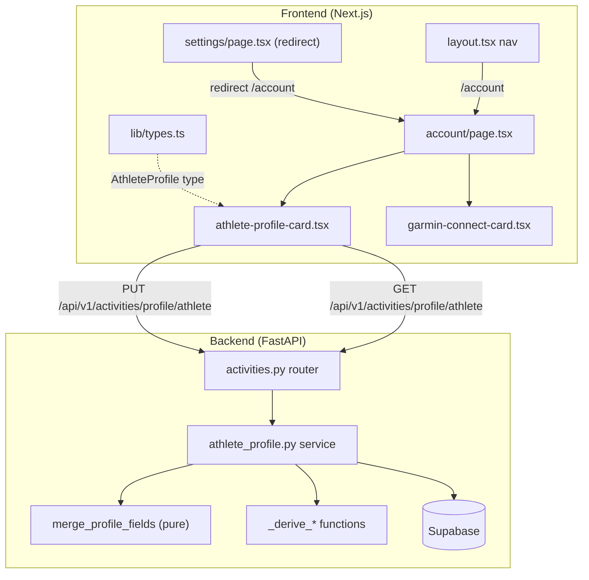
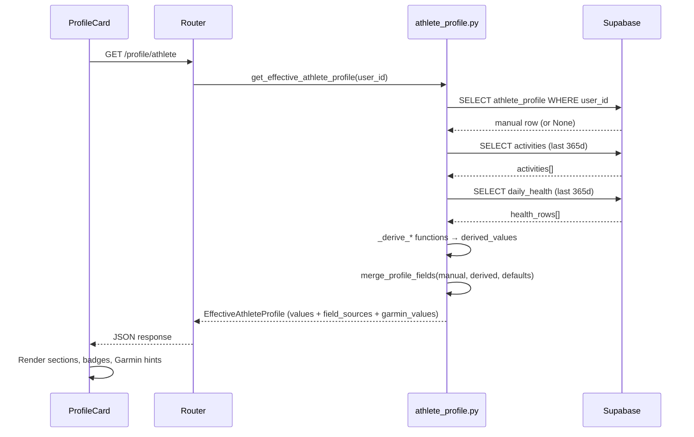

# Design Document: Account Page Redesign

## Overview

This feature renames the existing Settings page to Account, extends the backend API to surface previously hidden fields (`weekly_training_hours`, `field_sources`, `garmin_values`), and redesigns the athlete profile card with logical field sections, source indicators, and Garmin-derived context values.

The changes span three layers:

1. **Backend**: Extend `AthleteProfileSchema` and `EffectiveAthleteProfile` to include `weekly_training_hours`, `field_sources`, and a new `garmin_values` dict. Modify `get_effective_athlete_profile` to compute and return `garmin_values` alongside the existing merge logic.
2. **Frontend types**: Update `AthleteProfile` in `lib/types.ts` to include the new response fields.
3. **Frontend UI**: Move the page from `/settings` to `/account`, rename the nav entry, reorganize the profile card into five sections with source badges and Garmin context hints, and add a redirect from `/settings` to `/account`.

### Design Decisions

1. **Move the page directory** from `frontend/app/(app)/settings/` to `frontend/app/(app)/account/`. This gives a clean URL (`/account`) and avoids a mismatch between directory name and display label. A Next.js `redirect()` in a thin `settings/page.tsx` handles the old URL.
2. **Source indicators as Badge components** — Use shadcn/ui `Badge` with three variants: `default` for Manual (primary color), `secondary` for Default (muted), and a custom Garmin style (teal/cyan tint). Badges are compact and already used in the Garmin connect card.
3. **Garmin context as helper text** — When a field has a manual override and a Garmin-derived value exists, show "Garmin: {value}{unit}" as `text-xs text-muted-foreground` below the input. This is unobtrusive and follows the existing hint pattern.
4. **Section grouping via a config array** — Define sections as a typed constant array (similar to the existing `FIELDS` array) so the UI renders declaratively. Each section has a label and a list of field definitions.
5. **`garmin_values` as a flat dict** — Return `garmin_values: dict[str, float | int | None]` alongside `field_sources`. This keeps the API response flat and avoids nested structures. The frontend uses it for context display only.
6. **Pure merge function for testability** — Extract the merge logic (manual > garmin > default) into a pure function `merge_profile_fields` that takes manual values, derived values, and defaults, and returns `(effective_values, field_sources, garmin_values)`. This enables property-based testing without database mocking.

## Architecture



### Data Flow for GET /profile/athlete



## Components and Interfaces

### Backend Components

#### `merge_profile_fields` (new pure function in `athlete_profile.py`)

Extracted from the existing merge loop in `get_effective_athlete_profile`. Takes raw inputs and returns the merged result without any I/O.

```python
def merge_profile_fields(
    manual: AthleteProfileRow | None,
    derived_values: dict[str, int | float | None],
    profile_fields: tuple[str, ...] = PROFILE_FIELDS,
    default_mobility_target: int = DEFAULT_MOBILITY_TARGET,
) -> tuple[dict[str, int | float | None], dict[str, str], dict[str, int | float | None]]:
    """Merge manual, Garmin-derived, and default values.

    Returns:
        (effective_values, field_sources, garmin_values)
    """
```

Merge priority per field:
1. If manual value is not None → use manual, source = `"manual"`
2. Else if derived value is not None → use derived, source = `"garmin"`
3. Else → use None (or default for `mobility_sessions_per_week_target`), source = `"default"`

`garmin_values` always contains the derived value for every field regardless of whether a manual override exists.

#### Updated `EffectiveAthleteProfile` (Pydantic model)

```python
class EffectiveAthleteProfile(BaseModel):
    # ... existing fields ...
    weekly_training_hours: float | None = None
    field_sources: dict[str, str] = Field(default_factory=dict)
    garmin_values: dict[str, float | int | None] = Field(default_factory=dict)
```

#### Updated `AthleteProfileSchema` (response model in router)

```python
class AthleteProfileSchema(BaseModel):
    # ... existing fields ...
    weekly_training_hours: float | None
    field_sources: dict[str, str]
    garmin_values: dict[str, float | int | None]
    mobility_sessions_per_week_target: int
```

#### Updated `AthleteProfileUpdate` (request model in router)

```python
class AthleteProfileUpdate(BaseModel):
    # ... existing fields ...
    weekly_training_hours: float | None = None
```

### Frontend Components

#### Updated `AthleteProfile` type (`lib/types.ts`)

```typescript
export interface AthleteProfile {
  // ... existing numeric fields ...
  weekly_training_hours: number | null;
  mobility_sessions_per_week_target: number;
  field_sources: Record<string, "manual" | "garmin" | "default">;
  garmin_values: Record<string, number | null>;
}
```

#### Account page (`account/page.tsx`)

Replaces `settings/page.tsx`. Same structure — renders `AthleteProfileCard` and `GarminConnectCard` with the title "Account".

```typescript
export default function AccountPage() {
  return (
    <div className="px-4 py-6 sm:p-8 max-w-2xl mx-auto">
      <h1 className="text-xl sm:text-2xl font-semibold text-foreground mb-6">Account</h1>
      <div className="flex flex-col gap-6">
        <AthleteProfileCard />
        <GarminConnectCard />
      </div>
    </div>
  );
}
```

#### Settings redirect (`settings/page.tsx`)

```typescript
import { redirect } from "next/navigation";
export default function SettingsRedirect() {
  redirect("/account");
}
```

#### Redesigned `AthleteProfileCard` (`account/athlete-profile-card.tsx`)

The card is restructured around a `SECTIONS` config array:

```typescript
interface FieldDef {
  key: keyof AthleteProfile;
  label: string;
  unit: string;
  hint?: string;
}

interface Section {
  label: string;
  fields: FieldDef[];
}

const SECTIONS: Section[] = [
  {
    label: "Training Preferences",
    fields: [
      { key: "weekly_training_hours", label: "Weekly training hours", unit: "h", hint: "How many hours per week you can train (3–30)" },
      { key: "mobility_sessions_per_week_target", label: "Mobility target", unit: "sessions/week" },
    ],
  },
  {
    label: "Endurance Thresholds",
    fields: [
      { key: "ftp_watts", label: "FTP", unit: "W", hint: "Functional threshold power (cycling)" },
      { key: "threshold_pace_sec_per_km", label: "Run threshold pace", unit: "sec/km", hint: "e.g. 270 = 4:30/km" },
      { key: "swim_css_sec_per_100m", label: "Swim CSS", unit: "sec/100m", hint: "Critical swim speed" },
    ],
  },
  {
    label: "Heart Rate",
    fields: [
      { key: "max_hr", label: "Max HR", unit: "bpm" },
      { key: "resting_hr", label: "Resting HR", unit: "bpm" },
    ],
  },
  {
    label: "Strength",
    fields: [
      { key: "squat_1rm_kg", label: "Squat 1RM", unit: "kg" },
      { key: "deadlift_1rm_kg", label: "Deadlift 1RM", unit: "kg" },
      { key: "bench_1rm_kg", label: "Bench 1RM", unit: "kg" },
      { key: "overhead_press_1rm_kg", label: "Overhead Press 1RM", unit: "kg" },
    ],
  },
  {
    label: "Body",
    fields: [
      { key: "weight_kg", label: "Weight", unit: "kg" },
    ],
  },
];
```

Each field renders:
- A `Label` with field name and unit
- A source `Badge` next to the label (`"Manual"` / `"Garmin"` / `"Default"`)
- An optional hint line
- An `Input` (number type) with the effective value
- When source is `"manual"` and `garmin_values[key]` is non-null: a helper line `"Garmin: {value}{unit}"` in muted text

#### `SourceBadge` (inline helper in `athlete-profile-card.tsx`)

```typescript
function SourceBadge({ source }: { source: "manual" | "garmin" | "default" }) {
  const variants = {
    manual: "default",      // primary color
    garmin: "outline",      // teal/cyan tint via className override
    default: "secondary",   // muted
  } as const;
  const labels = { manual: "Manual", garmin: "Garmin", default: "Default" };
  return (
    <Badge
      variant={variants[source]}
      className={source === "garmin" ? "border-teal-500/50 text-teal-600 dark:text-teal-400" : ""}
    >
      {labels[source]}
    </Badge>
  );
}
```

#### Navigation update (`layout.tsx`)

Change the NAV_ITEMS entry:

```typescript
{ href: "/account", label: "Account", icon: "⚙️" },
```

## Data Models

### Backend Schema Changes

#### `EffectiveAthleteProfile` (updated)

| Field | Type | Description |
|---|---|---|
| ftp_watts | `int \| None` | Functional threshold power |
| threshold_pace_sec_per_km | `float \| None` | Run threshold pace |
| swim_css_sec_per_100m | `float \| None` | Critical swim speed |
| max_hr | `int \| None` | Maximum heart rate |
| resting_hr | `int \| None` | Resting heart rate |
| weight_kg | `float \| None` | Body weight |
| squat_1rm_kg | `float \| None` | Squat 1RM |
| deadlift_1rm_kg | `float \| None` | Deadlift 1RM |
| bench_1rm_kg | `float \| None` | Bench press 1RM |
| overhead_press_1rm_kg | `float \| None` | Overhead press 1RM |
| mobility_sessions_per_week_target | `int` | Mobility sessions target (default: 2) |
| weekly_training_hours | `float \| None` | Weekly training hours budget |
| field_sources | `dict[str, str]` | **Existing but not exposed** — source per field: `"manual"`, `"garmin"`, or `"default"` |
| garmin_values | `dict[str, float \| int \| None]` | **New** — raw Garmin-derived value per field (None when no Garmin data) |

#### `AthleteProfileSchema` (response model, updated)

Adds three fields that were previously computed but not returned:
- `weekly_training_hours: float | None`
- `field_sources: dict[str, str]`
- `garmin_values: dict[str, float | int | None]`

#### `AthleteProfileUpdate` (request model, updated)

Adds:
- `weekly_training_hours: float | None = None`

### Frontend Type Changes

#### `AthleteProfile` (updated)

```typescript
export interface AthleteProfile {
  ftp_watts: number | null;
  threshold_pace_sec_per_km: number | null;
  swim_css_sec_per_100m: number | null;
  max_hr: number | null;
  resting_hr: number | null;
  weight_kg: number | null;
  squat_1rm_kg: number | null;
  deadlift_1rm_kg: number | null;
  bench_1rm_kg: number | null;
  overhead_press_1rm_kg: number | null;
  mobility_sessions_per_week_target: number;
  weekly_training_hours: number | null;
  field_sources: Record<string, "manual" | "garmin" | "default">;
  garmin_values: Record<string, number | null>;
}
```

### Database

No database schema changes required. The `athlete_profile` table already has `weekly_training_hours`. The new `field_sources` and `garmin_values` fields are computed at query time by the service layer, not stored.


## Correctness Properties

*A property is a characteristic or behavior that should hold true across all valid executions of a system — essentially, a formal statement about what the system should do. Properties serve as the bridge between human-readable specifications and machine-verifiable correctness guarantees.*

The core testable logic in this feature is the `merge_profile_fields` pure function. It takes manual profile values, Garmin-derived values, and defaults, and produces three outputs: effective values, field sources, and garmin values. This function is a pure data transformation with a large input space (any combination of None/non-None values across 12+ fields), making it ideal for property-based testing.

The prework analysis identified three distinct, non-redundant properties after reflection:

### Property 1: Field sources completeness and validity

*For any* combination of manual profile values (each field independently None or a valid number) and Garmin-derived values (each field independently None or a valid number), `merge_profile_fields` SHALL return a `field_sources` dict that contains an entry for every field in `PROFILE_FIELDS`, and every value SHALL be one of `"manual"`, `"garmin"`, or `"default"`.

**Validates: Requirements 2.4**

### Property 2: Garmin values completeness and correctness

*For any* combination of manual profile values and Garmin-derived values, `merge_profile_fields` SHALL return a `garmin_values` dict that contains an entry for every field in `PROFILE_FIELDS`, and each entry's value SHALL equal the corresponding Garmin-derived input value (or None when no Garmin-derived value was provided for that field).

**Validates: Requirements 5.1**

### Property 3: Merge priority correctness

*For any* profile field and any combination of manual and Garmin-derived values:
- WHEN the manual value is not None, the effective value SHALL equal the manual value and the field source SHALL be `"manual"`.
- WHEN the manual value is None and the Garmin-derived value is not None, the effective value SHALL equal the Garmin-derived value and the field source SHALL be `"garmin"`.
- WHEN both the manual value and the Garmin-derived value are None, the field source SHALL be `"default"`.

The special case of `mobility_sessions_per_week_target` SHALL use the default value (2) when no manual value is set, with source `"default"`.

**Validates: Requirements 2.4, 2.5, 5.1**

## Error Handling

| Scenario | Layer | Handling |
|---|---|---|
| GET /profile/athlete fails | Frontend | Display error alert in the card. Existing `catch(() => {})` should be updated to show an error state. |
| PUT /profile/athlete fails | Frontend | Display error message below the save button (Req 7.3). Keep form state so user can retry. |
| No manual profile row exists | Backend | `get_manual_athlete_profile` returns None. Merge function treats all manual values as None — falls through to derived or default. Already handled. |
| No activities in last 365 days | Backend | All `_derive_*` functions return None. All fields fall through to default source. Already handled. |
| Garmin not connected | Backend | No activities or health data. Same as above — all derived values are None. `garmin_values` will be all None. |
| `weekly_training_hours` is negative or unreasonable | Backend | No validation change needed — the field is `float | None`. The frontend hint says "3–30" but the backend accepts any float. This matches existing behavior for other fields. |
| Old `/settings` URL bookmarked | Frontend | `settings/page.tsx` calls `redirect("/account")` — server-side 307 redirect. |
| `field_sources` or `garmin_values` missing from response (API version mismatch) | Frontend | Use optional chaining with fallback: `profile.field_sources?.[key] ?? "default"` and `profile.garmin_values?.[key] ?? null`. |

## Testing Strategy

### Property-Based Tests (Hypothesis, pytest)

The `merge_profile_fields` pure function is the primary target for property-based testing. It's a pure function with clear input/output behavior and a large input space (12 fields × 3 possible states each = thousands of combinations).

- **Library**: Hypothesis (already in backend dev dependencies, used in `test_plan_properties.py`)
- **Runner**: `pytest` (`cd backend && pytest tests/test_athlete_profile_properties.py -v`)
- **Minimum iterations**: 100 per property
- **Test file**: `backend/tests/test_athlete_profile_properties.py`

Each property test references its design document property:

| Property | Test Tag |
|---|---|
| Property 1 | `Feature: account-page-redesign, Property 1: Field sources completeness and validity` |
| Property 2 | `Feature: account-page-redesign, Property 2: Garmin values completeness and correctness` |
| Property 3 | `Feature: account-page-redesign, Property 3: Merge priority correctness` |

**Hypothesis strategies**:
- Generate `AthleteProfileRow` with each numeric field independently drawn from `st.none() | st.integers(min, max)` or `st.none() | st.floats(min, max)`
- Generate `derived_values` as a dict with each field independently drawn from `st.none() | st.integers/floats`
- Test the pure `merge_profile_fields` function directly — no database mocking needed

### Unit Tests (example-based, pytest)

Backend example tests in `backend/tests/test_athlete_profile_properties.py`:

- **Schema fields exist**: Verify `AthleteProfileSchema` has `weekly_training_hours`, `field_sources`, `garmin_values`
- **Update schema field**: Verify `AthleteProfileUpdate` has `weekly_training_hours`
- **Mobility default**: When no manual mobility target, effective value is 2 with source "default"
- **All-None inputs**: When manual is None and all derived are None, all sources are "default" and garmin_values are all None

### Frontend Tests (example-based, Vitest)

- **SECTIONS config**: Verify the five sections contain the correct fields per Req 3.2–3.6
- **SourceBadge rendering**: Verify correct label and variant for each source type
- **Garmin context hint**: When source is "manual" and garmin_value exists, helper text renders
- **Empty field placeholder**: When source is "default" and value is null, input shows placeholder
- **Navigation**: NAV_ITEMS contains `{ href: "/account", label: "Account" }`
- **Redirect**: `/settings` page calls `redirect("/account")`

### Integration Tests

- **PUT then GET round-trip**: Save a manual override, re-fetch, verify source is "manual" and garmin_values unchanged
- **Clear override**: Set a field to null via PUT, re-fetch, verify source reverts to "garmin" or "default"
- **Page renders**: Account page renders both AthleteProfileCard and GarminConnectCard
