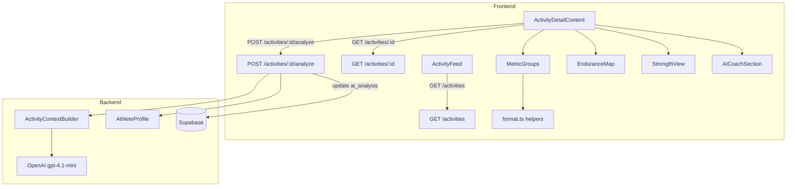

# Design Document: Activity Detail Insights

## Overview

This feature upgrades the activity feed and detail view across three areas:

1. **Activity Feed** — default to last 7 days with enhanced discipline-specific cards
2. **Activity Detail** — grouped metric sections (speed, HR, sport-specific, performance, elevation), HR zone visualization, and interactive GPS map
3. **AI Activity Analysis** — on-demand coaching insights following the same interpretive philosophy as the dashboard briefing

The implementation spans backend (expanded Pydantic response model, new analysis endpoint, activity context builder) and frontend (enhanced cards, metric groups, AI analysis UI, formatting helpers).

No database migrations are needed — all required columns already exist in the `activities` table.

## Architecture



### Key Design Decisions

1. **No new DB migrations**: The `activities` table already has `max_hr`, `normalized_power_watts`, `avg_cadence`, `intensity_factor`, `hr_zones`, `laps`, `aerobic_training_effect`, `anaerobic_training_effect`, `training_effect_label`. The backend Pydantic `ActivityDetail` response model simply needs to expose them.

2. **Activity context builder as a standalone function**: Similar to `coach_context.py`, a new `build_activity_analysis_context` function assembles activity data into a structured prompt. This keeps the router thin and the logic testable.

3. **Same AI model as dashboard briefing**: Uses `settings.openai_analysis_model` (gpt-4.1-mini) for cost efficiency, matching the dashboard briefing pipeline.

4. **7-day default is frontend-only**: The backend `GET /activities` endpoint stays unchanged. The frontend passes a `since` date parameter to filter, with a toggle to switch to the full paginated view.

5. **Cached analysis with re-analyze**: The `ai_analysis` and `ai_analyzed_at` fields already exist on the activities table. The analysis endpoint writes to these fields, and subsequent visits display the cached result. A "Re-analyze" button allows regeneration.

## Components and Interfaces

### Backend Changes

#### Expanded `ActivityDetail` Response Model (`backend/app/routers/activities.py`)

Add fields to the existing `ActivityDetail` Pydantic model:

```python
class ActivityDetail(ActivitySummary):
    # existing fields...
    polyline: str | None
    laps: Any
    hr_zones: Any
    exercises: Any
    primary_muscle_groups: list[str] | None
    notes: str | None
    ai_analysis: str | None
    ai_analyzed_at: str | None
    # new fields to expose:
    max_hr: int | None
    normalized_power_watts: int | None
    avg_cadence: int | None
    intensity_factor: float | None
    aerobic_training_effect: float | None
    anaerobic_training_effect: float | None
    training_effect_label: str | None
```

The `ActivitySummary` model already includes `total_volume_kg` and `calories`. The `GET /activities/{id}` endpoint already does `select("*")`, so no query changes needed — the Pydantic model just needs the additional fields.

#### `ActivitySummary` Update

Add `aerobic_training_effect`, `anaerobic_training_effect`, and `training_effect_label` to the list endpoint's select query so enhanced cards can show training effect data. The `calories` field is already included.

#### New Analysis Endpoint (`POST /activities/{activity_id}/analyze`)

```python
@router.post("/{activity_id}/analyze")
async def analyze_activity(
    activity_id: str,
    current_user: UserRow = Depends(get_current_user),
    sb: AsyncClient = Depends(get_supabase),
) -> dict:
    # 1. Fetch activity (verify ownership)
    # 2. Fetch athlete profile
    # 3. Build activity context via build_activity_analysis_context()
    # 4. Call OpenAI with ACTIVITY_ANALYSIS_SYSTEM_PROMPT
    # 5. Store result in activity.ai_analysis + ai_analyzed_at
    # 6. Return { "ai_analysis": "...", "ai_analyzed_at": "..." }
```

#### Activity Context Builder (`backend/app/services/activity_analysis.py`)

New service file with:

- `ACTIVITY_ANALYSIS_SYSTEM_PROMPT` — expert triathlon coach persona matching dashboard briefing philosophy
- `build_activity_analysis_context(activity: dict, profile: AthleteProfileRow) -> str` — assembles all activity data into structured text
- `generate_activity_analysis(activity: dict, profile: AthleteProfileRow) -> str` — calls OpenAI and returns analysis text

The context builder formats:
- Basic info: discipline, duration, distance, calories
- Pace/speed metrics with lap splits
- Heart rate: avg, max, zones with percentages
- Power: avg, normalized, intensity factor
- Cadence
- Training effects: aerobic, anaerobic, label
- Elevation gain
- Athlete profile thresholds for relative evaluation

### Frontend Changes

#### Updated TypeScript Types (`frontend/lib/types.ts`)

```typescript
export interface ActivityDetail extends ActivitySummary {
  // existing fields...
  // new fields:
  max_hr: number | null;
  normalized_power_watts: number | null;
  avg_cadence: number | null;
  intensity_factor: number | null;
  aerobic_training_effect: number | null;
  anaerobic_training_effect: number | null;
  training_effect_label: string | null;
  ai_analyzed_at: string | null;
}
```

#### New Format Helpers (`frontend/lib/format.ts`)

```typescript
formatSpeed(secPerKm: number | null): string     // pace → km/h
formatCadence(value: number | null, discipline: Discipline): string  // spm or rpm
formatPower(watts: number | null): string         // "X W"
formatHRZones(hrZones: unknown): HRZoneDisplay[]  // zone name, duration, percentage
```

#### Activity Feed Enhancement (`frontend/app/(app)/activities/activity-feed.tsx`)

- Add `since` query parameter support (ISO date string for last 7 days)
- Default state: `mode: "recent"` showing last 7 days
- Toggle button: "Show all activities" switches to `mode: "all"` (existing paginated behavior)
- Discipline filters work in both modes
- Enhanced `ActivityCard` with discipline-specific secondary metrics

#### Activity Detail Metric Groups (`frontend/app/(app)/activities/[id]/activity-detail-content.tsx`)

New sub-components rendered conditionally:

- `SpeedMetricsGroup` — avg pace, avg speed (derived from pace)
- `HeartRateMetricsGroup` — avg HR, max HR, HR zone bar chart
- `SportSpecificMetricsGroup` — cadence (run), power/NP/IF (cycling), sets/volume/muscles (strength)
- `PerformanceMetricsGroup` — aerobic/anaerobic training effect, label, TSS, calories
- `ElevationMetricsGroup` — elevation gain

Each group is hidden when all its metrics are null.

#### AI Coach Section (`frontend/app/(app)/activities/[id]/activity-detail-content.tsx`)

- When `ai_analysis` is null: show "Analyze" button
- When `ai_analysis` exists: show cached analysis + "Re-analyze" button
- Loading state during API call
- Error state on failure

## Data Models

### Backend Response Models

**ActivityDetail** (expanded — no DB changes):

| Field | Type | Source |
|---|---|---|
| max_hr | int \| None | activities.max_hr |
| normalized_power_watts | int \| None | activities.normalized_power_watts |
| avg_cadence | int \| None | activities.avg_cadence |
| intensity_factor | float \| None | activities.intensity_factor |
| aerobic_training_effect | float \| None | activities.aerobic_training_effect |
| anaerobic_training_effect | float \| None | activities.anaerobic_training_effect |
| training_effect_label | str \| None | activities.training_effect_label |
| ai_analyzed_at | str \| None | activities.ai_analyzed_at |
| hr_zones | Any | activities.hr_zones (JSONB, pass-through) |
| laps | Any | activities.laps (JSONB, pass-through) |

**AnalyzeResponse** (new):

| Field | Type |
|---|---|
| ai_analysis | str |
| ai_analyzed_at | str |

### Frontend Types

**HRZoneDisplay** (new):

```typescript
interface HRZoneDisplay {
  zone: string;        // "Zone 1", "Zone 2", etc.
  duration_seconds: number;
  percentage: number;  // 0-100
}
```

### hr_zones JSONB Structure (existing in DB)

The `hr_zones` field stores Garmin HR zone data as JSONB. Typical structure:

```json
[
  { "zone": "Zone 1", "low_hr": 0, "high_hr": 120, "duration_seconds": 300 },
  { "zone": "Zone 2", "low_hr": 120, "high_hr": 140, "duration_seconds": 1200 },
  ...
]
```

The `formatHRZones` helper computes percentages from duration_seconds relative to total duration.

## Correctness Properties

*A property is a characteristic or behavior that should hold true across all valid executions of a system — essentially, a formal statement about what the system should do. Properties serve as the bridge between human-readable specifications and machine-verifiable correctness guarantees.*

### Property 1: Seven-day filter returns only recent activities

*For any* list of activities with various `start_time` values, filtering to the last 7 calendar days SHALL return only activities whose `start_time` falls within the 7-day window, and no activities outside that window.

**Validates: Requirements 1.1**

### Property 2: Combined discipline and date filter intersection

*For any* list of activities, any discipline filter, and any date range, the filtered result SHALL contain only activities that match both the selected discipline AND fall within the date range.

**Validates: Requirements 1.4**

### Property 3: Activity card displays required fields for all disciplines

*For any* activity with non-null calories, the rendered activity card SHALL include the calories value regardless of discipline. *For any* activity, the card SHALL include the discipline icon, name (or discipline label), relative date, and duration.

**Validates: Requirements 2.1, 2.5**

### Property 4: Response model preserves all fields including nulls

*For any* valid activity data dictionary containing the fields `max_hr`, `normalized_power_watts`, `avg_cadence`, `intensity_factor`, `aerobic_training_effect`, `anaerobic_training_effect`, `training_effect_label`, and `total_volume_kg`, serializing through the `ActivityDetail` Pydantic model SHALL preserve all field values. When any of these fields are `None`, the serialized output SHALL contain the key with a `null` value rather than omitting it.

**Validates: Requirements 3.1, 3.3**

### Property 5: HR zones data round-trip preservation

*For any* valid `hr_zones` JSONB structure stored in the database, the `ActivityDetail` response SHALL return the identical structure without transformation.

**Validates: Requirements 3.2**

### Property 6: Metric group visibility follows data availability

*For any* activity, a metric group SHALL be visible if and only if at least one of its constituent metrics has a non-null value. When all metrics in a group are null, the group SHALL be hidden entirely.

**Validates: Requirements 4.2, 4.7, 4.9**

### Property 7: Activity context builder includes all non-null fields

*For any* activity with non-null metric fields (distance, duration, avg_hr, max_hr, avg_pace, avg_power, normalized_power, avg_cadence, tss, intensity_factor, aerobic/anaerobic training effects, elevation_gain, calories, laps, hr_zones), the context builder output string SHALL contain a representation of each non-null field.

**Validates: Requirements 6.3**

### Property 8: formatSpeed converts pace to speed correctly

*For any* positive pace value in seconds per kilometer, `formatSpeed(pace)` SHALL return a string representing `3600 / pace` formatted to one decimal place with "km/h" suffix.

**Validates: Requirements 8.2**

### Property 9: formatCadence applies correct unit by discipline

*For any* cadence value and discipline, `formatCadence(value, discipline)` SHALL return the value with "spm" suffix for RUN discipline and "rpm" suffix for cycling disciplines (RIDE_ROAD, RIDE_GRAVEL).

**Validates: Requirements 8.3**

### Property 10: formatPower appends watt unit

*For any* non-null watt value, `formatPower(watts)` SHALL return a string containing the numeric value followed by "W".

**Validates: Requirements 8.4**

### Property 11: HR zone percentages sum to approximately 100%

*For any* valid `hr_zones` array where at least one zone has a positive duration, `formatHRZones` SHALL return zone objects whose `percentage` values sum to between 99.0 and 101.0 (accounting for rounding).

**Validates: Requirements 8.5**

## Error Handling

| Scenario | Handling |
|---|---|
| AI API unavailable during analysis | Return HTTP 503 with message "Analysis could not be generated. Please try again later." Frontend shows user-friendly error. |
| AI API returns malformed response | Log error, return HTTP 502 with message "Analysis generation failed." |
| Activity not found for analysis | Return HTTP 404 (existing behavior from `get_activity`). |
| Activity has no meaningful data for analysis | Generate analysis with available data; the AI model handles sparse input gracefully. |
| `hr_zones` is null or malformed | `formatHRZones` returns empty array; HR zone visualization is hidden. |
| Mapbox token missing | Existing behavior: show placeholder message. |
| `formatSpeed` receives null or zero pace | Return "—" dash placeholder. |
| Network error during analysis request | Frontend catches error, hides loading state, shows retry-able error message. |

## Testing Strategy

### Property-Based Tests (Backend — Python, Hypothesis)

The backend pure functions are well-suited for property-based testing:

- **Activity context builder** (`build_activity_analysis_context`): generate random activity dicts, verify all non-null fields appear in output
- **Pydantic model serialization**: generate random activity data, verify field preservation and null handling
- **Format helpers** (if mirrored in backend): pace-to-speed conversion, HR zone percentage calculation

Library: **Hypothesis** (already used in the project — see `backend/tests/test_briefing_properties.py`)
Configuration: minimum 100 examples per property test.
Tag format: `# Feature: activity-detail-insights, Property {N}: {description}`

### Property-Based Tests (Frontend — TypeScript, fast-check)

Frontend formatting helpers are pure functions ideal for PBT:

- `formatSpeed`: pace → speed conversion correctness
- `formatCadence`: unit suffix correctness by discipline
- `formatPower`: watt formatting
- `formatHRZones`: percentage sum invariant, zone count preservation

Library: **fast-check**
Configuration: `{ numRuns: 100 }` per property.
Tag format: `// Feature: activity-detail-insights, Property {N}: {description}`

### Unit Tests (Example-Based)

- Activity feed: default 7-day mode renders, toggle to all-activities mode, empty state
- Activity card: discipline-specific metric rendering (endurance shows distance + calories, strength shows sets + volume, yoga shows duration + calories)
- Metric groups: conditional visibility per discipline
- AI coach section: analyze button when no analysis, cached analysis display, re-analyze button, loading state, error state
- Analysis endpoint: mocked OpenAI call, verify DB update of `ai_analysis` and `ai_analyzed_at`
- GPS map: existing tests for start/end markers and bounds fitting

### Integration Tests

- `POST /activities/{id}/analyze`: end-to-end with mocked OpenAI, verify response shape and DB persistence
- `GET /activities/{id}`: verify expanded response includes new fields
- Activity feed with `since` parameter: verify correct filtering
