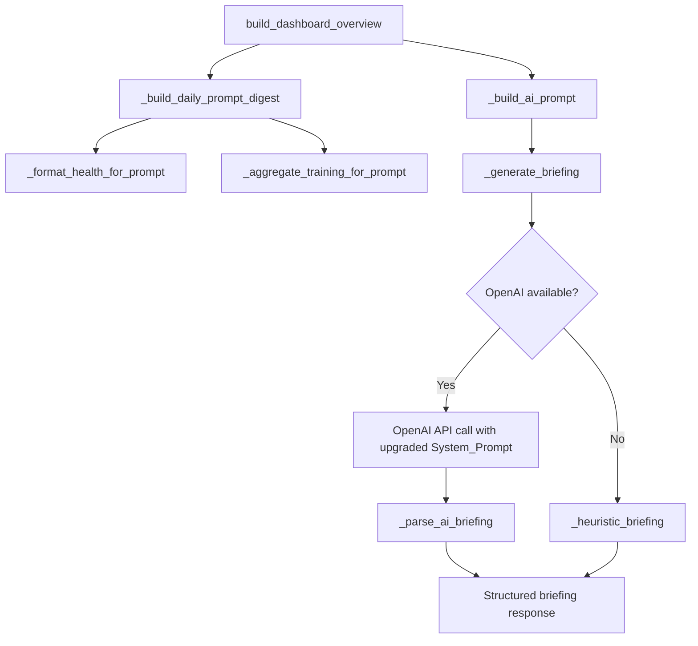

# Design Document: AI Coach Insights

## Overview

This feature upgrades the AI Coach briefing pipeline end-to-end across 8 requirements: fixing data timing so partial metrics aren't misinterpreted, adding today's planned workouts to the prompt, applying recency weights to the 7-day digest, enforcing a structured 4-recommendation output with a mandatory watchout, upgrading the system prompt for interpretive coaching, grounding advice in triathlon-specific science, aligning the heuristic fallback to the same structure, and hardening the response parser.

All changes are confined to the backend briefing pipeline in `backend/app/services/dashboard.py` — specifically the functions `_format_health_for_prompt`, `_build_daily_prompt_digest`, `_build_ai_prompt`, `_generate_briefing` (system prompt), `_heuristic_briefing`, and `_parse_ai_briefing`. The frontend `coach-briefing-card.tsx` already supports the `caution` field and a variable-length `recommendations` array, so no frontend changes are needed.

## Architecture

The briefing pipeline is a linear data flow within `dashboard.py`:



### Change Scope

1. **`_format_health_for_prompt`** — Accept a new `is_today` parameter. When `True`, set `steps` and `daily_calories` to `None`.
2. **`_build_daily_prompt_digest`** — Pass `is_today` flag to `_format_health_for_prompt` for today's entry. Add `recency_weight` field to each day's entry.
3. **`_build_ai_prompt`** — Accept a new `planned_workouts` parameter and include it in the prompt JSON payload.
4. **`_generate_briefing`** — Rewrite the system prompt to enforce 4 recommendations, mandatory caution, triathlon persona, interpretive analysis style, recency weighting instructions, and planned workout awareness. Accept `planned_workouts` and pass to `_build_ai_prompt`.
5. **`_heuristic_briefing`** — Restructure to always produce exactly 4 recommendations (at least one recovery, one training), always populate `caution`, and use yesterday's finalized data as primary input.
6. **`_parse_ai_briefing`** — Enforce exactly 4 recommendations (pad from heuristic fallback or truncate). Substitute `caution` from fallback when null/missing.
7. **`build_dashboard_overview`** — Thread `planned_workouts` (today's scheduled workouts) through to `_generate_briefing`.

## Components and Interfaces

### Modified Functions

#### `_format_health_for_prompt(health, is_today=False)`

```python
def _format_health_for_prompt(
    health: DailyHealthRow | None,
    is_today: bool = False,
) -> dict[str, Any]:
```

- **New parameter**: `is_today: bool = False`
- **Behavior change**: When `is_today=True`, returns `steps: None` and `daily_calories: None` regardless of the health row's values. All other metrics (sleep_score, sleep_hours, hrv_ms, resting_hr, readiness, stress, spo2, respiration) are returned normally since they are finalized overnight metrics.
- **Backward compatible**: Default `is_today=False` preserves existing behavior for past dates.

#### `_build_daily_prompt_digest(local_date, health_rows_7d, activities_7d, tz)`

Signature unchanged. Internal changes:
- Passes `is_today=True` to `_format_health_for_prompt` when `day == local_date`.
- Adds a `recency_weight` float field to each day's dict entry. Weights are computed using an exponential decay scheme where yesterday gets the highest weight and each preceding day gets progressively less. All 7 weights sum to 1.0, with yesterday receiving at least 0.25.

#### `_build_ai_prompt(timezone_name, local_date, health_rows_7d, activities_7d, goals, fitness, planned_workouts)`

```python
def _build_ai_prompt(
    timezone_name: str,
    local_date: date,
    health_rows_7d: list[DailyHealthRow],
    activities_7d: list[ActivityRow],
    goals: list[dict[str, Any]],
    fitness: dict[str, Any],
    planned_workouts: list[dict[str, Any]] | None = None,
) -> str:
```

- **New parameter**: `planned_workouts` — list of today's planned workout dicts (name, discipline, estimated_duration_seconds, estimated_tss).
- **Behavior change**: Includes `planned_workouts_today` key in the JSON payload.

#### `_generate_briefing(..., planned_workouts)`

```python
async def _generate_briefing(
    overview: dict[str, Any],
    timezone_name: str,
    local_date: date,
    local_time: datetime,
    health_rows_7d: list[DailyHealthRow],
    activities_7d: list[ActivityRow],
    goals: list[dict[str, Any]],
    planned_workouts: list[dict[str, Any]] | None = None,
) -> dict[str, Any]:
```

- **New parameter**: `planned_workouts`
- **System prompt rewrite**: Complete replacement of the `instructions` string with the upgraded triathlon-focused coaching persona, 4-recommendation format, mandatory caution, interpretive analysis rules, recency weighting instructions, and planned workout awareness.
- Passes `planned_workouts` through to `_build_ai_prompt`.

#### `_heuristic_briefing(overview, local_date, local_time)`

Signature unchanged. Internal restructure:
- Always produces exactly 4 recommendations.
- Guarantees at least one recovery-focused and one training-focused recommendation.
- Always populates `caution` with a relevant watchout derived from recovery and activity status (never returns `None`).
- Uses yesterday's finalized data as primary input (consistent with data timing corrections).

#### `_parse_ai_briefing(text, fallback)`

Signature unchanged. Behavior changes:
- If `recommendations` has fewer than 4 items, pads with items from `fallback["recommendations"]` to reach exactly 4.
- If `recommendations` has more than 4 items, truncates to the first 4.
- If `caution` is null, empty, or missing, substitutes `fallback["caution"]`.
- If JSON parsing fails entirely, returns the fallback (unchanged behavior).

### Recency Weight Computation

The recency weights use an exponential decay scheme:

```python
def _compute_recency_weights(num_days: int = 7) -> list[float]:
    """Compute recency weights for a 7-day digest.
    
    Yesterday (index -2, i.e. days_ago=1) gets the highest raw weight.
    Today (index -1, i.e. days_ago=0) gets the same weight as yesterday
    since today's data is partial but still the most recent recovery signal.
    Weights decay exponentially for older days and are normalized to sum to 1.0.
    """
    raw = []
    for days_ago in range(num_days - 1, -1, -1):
        # days_ago=0 is today, days_ago=1 is yesterday, etc.
        if days_ago <= 1:
            raw.append(2.0 ** (num_days - 2))  # yesterday and today get max weight
        else:
            raw.append(2.0 ** (num_days - 1 - days_ago))
    total = sum(raw)
    return [round(w / total, 3) for w in raw]
```

This produces weights like: `[0.016, 0.031, 0.063, 0.125, 0.25, 0.25, 0.266]` (oldest → today), ensuring yesterday gets ≥ 0.25 of total weight.

### Planned Workouts Threading

`build_dashboard_overview` already fetches workouts and computes `upcoming_workouts`. We filter for today's date and pass them to `_generate_briefing`:

```python
today_planned = [
    w for w in upcoming_workouts
    if w.get("scheduled_date") == today.isoformat()
]
```

Each planned workout dict contains: `name`, `discipline`, `scheduled_date`, `estimated_duration_seconds`, `estimated_tss`, `description`.

## Data Models

### Daily Digest Entry (per day in the 7-day array)

```python
{
    "date": "2024-01-15",
    "recency_weight": 0.25,          # NEW — float, all 7 sum to 1.0
    "health": {
        "sleep_score": 82.0,
        "sleep_hours": 7.2,
        "hrv_ms": 65.0,
        "resting_hr": 52.0,
        "readiness": 72.0,
        "stress": 25.0,
        "spo2": 98.0,
        "respiration": 14.5,
        "steps": null,                # null for today (Partial_Metric)
        "daily_calories": null,       # null for today (Partial_Metric)
    },
    "training": {
        "sessions": 1,
        "distance_km": 10.5,
        "duration_hours": 1.0,
        "tss": 45.0,
        "by_discipline": { ... }
    }
}
```

### AI Prompt Payload (JSON sent to OpenAI)

```python
{
    "date": "2024-01-15",
    "timezone": "America/New_York",
    "daily_digest_7d": [ ... ],       # 7 entries as above
    "fitness": {
        "ctl": 42.0,
        "atl": 55.0,
        "tsb": -13.0,
        "direction": "training"
    },
    "goals": [ ... ],
    "planned_workouts_today": [       # NEW
        {
            "name": "Easy Run",
            "discipline": "RUN",
            "estimated_duration_seconds": 3600,
            "estimated_tss": 45.0
        }
    ]
}
```

### Briefing Response (from AI or heuristic)

```python
{
    "source": "ai" | "heuristic",
    "generated_for_date": "2024-01-15",
    "generated_at": "2024-01-15T12:00:00Z",
    "ai_enabled": True,
    "sleep_analysis": "...",
    "activity_analysis": "...",
    "recommendations": ["...", "...", "...", "..."],  # exactly 4 (was 3)
    "caution": "..."                                   # always non-null (was nullable)
}
```

No database schema changes are needed. The `daily_briefings.briefing` column is a JSONB field that stores the briefing dict — the new 4-recommendation structure and non-null caution are backward compatible since the frontend already handles variable-length arrays and conditionally renders caution.


## Correctness Properties

*A property is a characteristic or behavior that should hold true across all valid executions of a system — essentially, a formal statement about what the system should do. Properties serve as the bridge between human-readable specifications and machine-verifiable correctness guarantees.*

### Property 1: Today's health entry nulls partial metrics but preserves recovery metrics

*For any* `DailyHealthRow` with arbitrary values for all fields, calling `_format_health_for_prompt(health, is_today=True)` SHALL return `steps=None` and `daily_calories=None`, while preserving the values of `sleep_score`, `sleep_hours`, `hrv_ms`, `resting_hr`, `readiness`, `stress`, `spo2`, and `respiration` from the input row. Conversely, calling `_format_health_for_prompt(health, is_today=False)` SHALL preserve all fields including `steps` and `daily_calories`.

**Validates: Requirements 1.1, 1.2, 1.3, 1.4**

### Property 2: Today's training sessions are preserved in the digest

*For any* set of activities that fall on today's date, the entry for today in the digest returned by `_build_daily_prompt_digest` SHALL include a `training` dict whose `sessions` count, `distance_km`, `duration_hours`, and `tss` match the aggregated values of those activities.

**Validates: Requirements 1.5**

### Property 3: Planned workouts round-trip through the AI prompt

*For any* list of planned workout dicts (including the empty list), calling `_build_ai_prompt` with that list and then parsing the resulting JSON SHALL produce a `planned_workouts_today` array that equals the input list.

**Validates: Requirements 2.1, 2.2**

### Property 4: Recency weights are present, sum to 1.0, and weight yesterday highest

*For any* 7-day digest produced by `_build_daily_prompt_digest`, every entry SHALL have a `recency_weight` float field, the sum of all 7 weights SHALL equal 1.0 (within floating-point tolerance of ±0.01), and yesterday's entry SHALL have a weight of at least 0.25.

**Validates: Requirements 3.1, 3.2**

### Property 5: Parsed AI briefing always has exactly 4 recommendations

*For any* JSON string containing a `recommendations` array of any length (0, 1, 2, 3, 5, 10, etc.) and any fallback dict with its own recommendations, `_parse_ai_briefing` SHALL return a briefing with exactly 4 recommendations — truncating if the AI returned more than 4, or padding from the fallback if fewer than 4.

**Validates: Requirements 4.6, 8.1, 8.2**

### Property 6: Parsed AI briefing substitutes fallback caution when AI caution is absent

*For any* valid JSON AI response where the `caution` field is null, empty string, or missing, and any fallback dict with a non-null `caution`, `_parse_ai_briefing` SHALL return a briefing whose `caution` equals the fallback's `caution` value.

**Validates: Requirements 8.3**

### Property 7: Invalid JSON returns the fallback briefing

*For any* string that is not valid JSON and any fallback dict, `_parse_ai_briefing` SHALL return the fallback dict unchanged.

**Validates: Requirements 8.4**

### Property 8: Heuristic briefing always produces exactly 4 recommendations and a non-null caution

*For any* overview dict with valid recovery and activity sections, `_heuristic_briefing` SHALL return a briefing with exactly 4 items in the `recommendations` array and a `caution` field that is a non-empty string (never None).

**Validates: Requirements 4.7, 7.1, 7.4**

## Error Handling

| Scenario | Handling |
|---|---|
| OpenAI API unavailable or raises exception | `_generate_briefing` catches all exceptions and returns the heuristic fallback. Existing behavior, unchanged. |
| AI returns invalid JSON | `_parse_ai_briefing` catches `json.JSONDecodeError` and returns the heuristic fallback in its entirety (Req 8.4). |
| AI returns fewer than 4 recommendations | `_parse_ai_briefing` pads from the heuristic fallback to reach exactly 4 (Req 8.1). |
| AI returns more than 4 recommendations | `_parse_ai_briefing` truncates to the first 4 (Req 8.2). |
| AI returns null/missing caution | `_parse_ai_briefing` substitutes the heuristic fallback's caution (Req 8.3). |
| No health data for today | `_format_health_for_prompt(None, is_today=True)` returns all-null dict. Existing behavior for None input, unchanged. |
| No planned workouts for today | `_build_ai_prompt` includes `planned_workouts_today: []`. The system prompt instructs the AI to note the rest day. |
| Heuristic fallback with minimal data | `_heuristic_briefing` always produces 4 recommendations and a non-null caution by using default messages when specific metric thresholds aren't triggered. |

## Testing Strategy

### Property-Based Tests (Hypothesis)

The project uses Python with pytest. We will use [Hypothesis](https://hypothesis.readthedocs.io/) for property-based testing, which is the standard PBT library for Python.

Each property test runs a minimum of **100 iterations** with randomly generated inputs. Each test is tagged with a comment referencing its design property.

| Property | Function Under Test | Generator Strategy |
|---|---|---|
| Property 1 | `_format_health_for_prompt` | Random `DailyHealthRow` with arbitrary metric values × `is_today` boolean |
| Property 2 | `_build_daily_prompt_digest` | Random activities with today's date, random health rows |
| Property 3 | `_build_ai_prompt` | Random lists of planned workout dicts (0–5 items) |
| Property 4 | `_build_daily_prompt_digest` | Random health rows and activities for 7-day window |
| Property 5 | `_parse_ai_briefing` | Random JSON with recommendations arrays of length 0–10, random fallback |
| Property 6 | `_parse_ai_briefing` | Random valid JSON with caution set to null/empty/missing, random fallback with non-null caution |
| Property 7 | `_parse_ai_briefing` | Random non-JSON strings (using `text()` strategy filtered to exclude valid JSON) |
| Property 8 | `_heuristic_briefing` | Random overview dicts with varying recovery statuses and activity statuses |

**Tag format**: `# Feature: ai-coach-insights, Property {N}: {title}`

### Unit Tests (pytest)

Unit tests cover specific examples and edge cases not suited for PBT:

- **System prompt content** (Requirements 2.3, 3.3, 4.1–4.5, 5.1–5.4, 6.1–6.4): Verify the system prompt string contains required instructions (planned workouts, recency weighting, 4 recommendations, mandatory caution, triathlon persona, interpretive analysis, no generic filler, cross-discipline awareness, evidence-based science).
- **Heuristic category coverage** (Requirements 7.2, 7.3): Verify at least one recommendation references recovery and one references training across several representative overview inputs.
- **Heuristic uses yesterday's data** (Requirement 7.5): Verify the heuristic references `last_night` data from the overview.
- **Recency weight edge case**: Verify weights for a digest with all-null health data still sum to 1.0.
- **Regression**: Verify `_format_health_for_prompt(None)` still returns all-null dict (bugfix spec 3.3).
- **Regression**: Verify `_today_data_signature` still includes steps/calories in the hash (bugfix spec 3.6).

### Test File Organization

- **Property tests**: `backend/tests/test_briefing_properties.py` — new file for all 8 property-based tests.
- **Unit tests**: `backend/tests/test_dashboard_helpers.py` — extend existing file with new unit tests for system prompt content and heuristic behavior.
