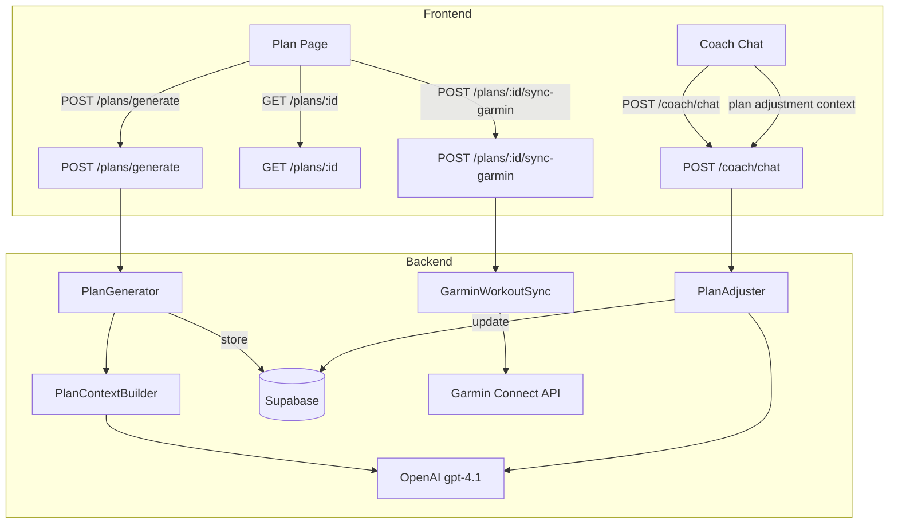

# Design Document: AI Training Plans

## Overview

An AI-powered training plan engine that generates periodized multi-sport training plans based on athlete goals, fitness data, and weekly availability. Plans are adjustable via the AI coach chat and sync to Garmin for execution.

The system reads 7 weeks of health/fitness data (sleep, HRV, recovery, activities, CTL/ATL/TSB), combines it with athlete goals (e.g., marathon on 2026-09-15, Ironman 70.3) and a weekly hours budget, then generates a structured periodized plan spanning Base → Build → Peak → Taper phases. Plans include swim, cycle, run, strength, and yoga/mobility sessions.

## Architecture



### Key Design Decisions

1. **Plans are collections of WorkoutRows**: A training plan is a metadata record (`training_plans` table) that references existing `workouts` rows via `plan_id` foreign key. This reuses the existing workout system entirely — no new workout storage needed.

2. **AI generates the full plan in one call**: A single OpenAI call with comprehensive context (athlete profile, fitness timeline, goals, health data) generates the entire plan structure as JSON. This is more coherent than multi-step generation because the AI can reason about periodization across the full timeline.

3. **Plan adjustments modify workouts in-place**: When the coach adjusts a plan (e.g., "skip cycling today, my knee hurts"), the affected workout rows are updated directly. An `adjustments` JSONB array on the plan tracks the history.

4. **Garmin sync uses the existing `garminconnect` library**: The library supports creating workouts on Garmin Connect. Each synced workout gets a `garmin_workout_id` stored on the workout row.

5. **Goals are enhanced, not replaced**: The existing `goals` table gets new fields (`race_type`, `weekly_hours_budget`, `priority`) to support plan generation. The existing coach goals UI is extended.

6. **Route suggestions are deferred**: Routes are already available via the route planner. The plan can reference suggested distances/terrains, but route generation is a separate user action (not auto-generated per workout).

## High-Level Design

### Data Model

#### New Table: `training_plans`

```sql
CREATE TABLE training_plans (
  id              UUID PRIMARY KEY DEFAULT gen_random_uuid(),
  user_id         UUID REFERENCES users(id) ON DELETE CASCADE NOT NULL,
  goal_id         UUID REFERENCES goals(id) ON DELETE SET NULL,
  name            TEXT NOT NULL,
  status          TEXT NOT NULL DEFAULT 'active',  -- active, completed, archived
  race_date       DATE,
  start_date      DATE NOT NULL,
  end_date        DATE NOT NULL,
  weekly_hours    FLOAT NOT NULL,
  plan_structure  JSONB NOT NULL DEFAULT '{}',  -- periodization phases, weekly TSS targets
  adjustments     JSONB NOT NULL DEFAULT '[]',  -- history of AI adjustments
  created_at      TIMESTAMPTZ DEFAULT now(),
  updated_at      TIMESTAMPTZ DEFAULT now()
);
```

#### Modified Table: `workouts` (add plan_id)

```sql
ALTER TABLE workouts ADD COLUMN plan_id UUID REFERENCES training_plans(id) ON DELETE SET NULL;
ALTER TABLE workouts ADD COLUMN plan_week INT;
ALTER TABLE workouts ADD COLUMN plan_day INT;  -- 0=Monday, 6=Sunday
```

#### Modified Table: `goals` (add plan fields)

```sql
ALTER TABLE goals ADD COLUMN race_type TEXT;  -- marathon, ironman_70_3, ironman, olympic_tri, half_marathon, 10k, century_ride, custom
ALTER TABLE goals ADD COLUMN weekly_hours_budget FLOAT;
ALTER TABLE goals ADD COLUMN priority INT DEFAULT 1;  -- 1=primary, 2=secondary
```

### Plan Structure (JSONB)

```json
{
  "total_weeks": 16,
  "phases": [
    { "name": "Base", "weeks": [1, 2, 3, 4, 5, 6], "focus": "Aerobic foundation, technique", "weekly_tss_range": [200, 350] },
    { "name": "Build", "weeks": [7, 8, 9, 10, 11], "focus": "Race-specific intensity", "weekly_tss_range": [350, 500] },
    { "name": "Peak", "weeks": [12, 13, 14], "focus": "Race simulation, sharpening", "weekly_tss_range": [400, 550] },
    { "name": "Taper", "weeks": [15, 16], "focus": "Volume reduction, freshness", "weekly_tss_range": [150, 250] }
  ],
  "weekly_hours_distribution": {
    "swim": 0.15,
    "bike": 0.35,
    "run": 0.30,
    "strength": 0.12,
    "mobility": 0.08
  },
  "recovery_week_pattern": [3, 1]  -- 3 load weeks, 1 recovery week
}
```

### Workout Content Format (existing JSONB, extended)

For AI-generated workouts, the `content` JSONB follows this structure:

```json
{
  "type": "intervals",  // easy, tempo, intervals, long, threshold, vo2max, recovery, brick, strength, mobility
  "warmup": { "duration_min": 10, "zone": "Z1-Z2", "description": "Easy jog building to moderate" },
  "main": [
    { "duration_min": 5, "zone": "Z4", "description": "Threshold intervals", "repeats": 4, "rest_min": 2 }
  ],
  "cooldown": { "duration_min": 10, "zone": "Z1", "description": "Easy jog" },
  "target_tss": 65,
  "target_hr_zone": "Z4",
  "notes": "Focus on maintaining consistent pace across all intervals"
}
```

### Component Architecture

#### Backend Services

1. **`backend/app/services/plan_generator.py`** — Core plan generation
   - `build_plan_context(user_id, goal, sb) -> str` — Assembles athlete data into AI prompt
   - `generate_plan(user_id, goal_id, sb) -> TrainingPlan` — Calls OpenAI, parses response, creates plan + workouts in DB
   - `PLAN_GENERATION_SYSTEM_PROMPT` — Expert periodization coach persona

2. **`backend/app/services/plan_adjuster.py`** — Plan modification via coach
   - `adjust_plan(plan_id, user_message, sb) -> AdjustmentResult` — AI-powered plan adjustment
   - Reads current plan state, health data, generates modified workouts

3. **`backend/app/services/garmin_workout_sync.py`** — Push workouts to Garmin
   - `sync_plan_to_garmin(plan_id, user_id, sb) -> SyncResult` — Batch sync upcoming workouts
   - `convert_workout_to_garmin(workout) -> dict` — Convert content JSONB to Garmin format
   - Uses `garminconnect` library's workout creation API

#### Backend Endpoints (new router: `backend/app/routers/plans.py`)

| Method | Path | Description |
|--------|------|-------------|
| POST | `/plans/generate` | Generate a new plan from a goal |
| GET | `/plans` | List user's plans |
| GET | `/plans/{id}` | Get plan with all workouts |
| PUT | `/plans/{id}` | Update plan metadata |
| DELETE | `/plans/{id}` | Archive plan |
| POST | `/plans/{id}/adjust` | AI-adjust plan (from coach chat) |
| POST | `/plans/{id}/sync-garmin` | Sync upcoming workouts to Garmin |
| GET | `/plans/{id}/compliance` | Get plan compliance stats |

#### Frontend Pages

1. **Plan Generation Page** (`frontend/app/(app)/workouts/plan/`)
   - Goal selection (existing goals or create new)
   - Weekly hours budget input
   - Race type selection
   - "Generate Plan" button → loading → plan preview
   - Accept/modify/regenerate

2. **Plan View Page** (`frontend/app/(app)/workouts/plan/[id]/`)
   - Calendar/week view of workouts
   - Phase indicators (Base/Build/Peak/Taper)
   - Weekly TSS target vs actual
   - Compliance percentage
   - "Sync to Garmin" button
   - "Adjust with Coach" button → opens coach chat with plan context

3. **Enhanced Coach Chat** (modify existing)
   - When active plan exists, coach context includes current plan state
   - Coach can suggest and apply plan adjustments
   - Adjustment history visible in plan view

## Low-Level Design

### Plan Generation Flow

```python
async def generate_plan(user_id: str, goal_id: str, sb: AsyncClient) -> dict:
    # 1. Fetch goal
    goal = await fetch_goal(user_id, goal_id, sb)
    
    # 2. Build context (athlete profile, 7-week fitness, health, current training)
    context = await build_plan_context(user_id, goal, sb)
    
    # 3. Call OpenAI with periodization system prompt
    plan_json = await call_openai(PLAN_SYSTEM_PROMPT, context)
    
    # 4. Parse and validate plan structure
    plan_data = parse_plan_response(plan_json)
    
    # 5. Create training_plans row
    plan_row = await create_plan_row(user_id, goal, plan_data, sb)
    
    # 6. Create workout rows for each session
    workouts = await create_plan_workouts(plan_row.id, user_id, plan_data, sb)
    
    # 7. Return complete plan
    return {"plan": plan_row, "workouts": workouts}
```

### Plan Context Builder

```python
async def build_plan_context(user_id: str, goal: GoalRow, sb: AsyncClient) -> str:
    """Build comprehensive context for AI plan generation."""
    profile = await get_effective_athlete_profile(user_id, sb)
    
    # Last 7 weeks of fitness data
    fitness = await get_fitness_timeline(user_id, sb, days=49)
    
    # Last 7 weeks of health data
    health = await fetch_health_data(user_id, sb, days=49)
    
    # Last 7 weeks of activities
    activities = await fetch_recent_activities(user_id, sb, days=49)
    
    # Current CTL/ATL/TSB
    current_fitness = fitness[-1] if fitness else None
    
    # Format into structured prompt
    return format_plan_prompt(profile, goal, fitness, health, activities, current_fitness)
```

### AI System Prompt (Plan Generation)

The system prompt instructs the AI to:
- Act as an elite triathlon/endurance coach with periodization expertise
- Generate a week-by-week plan with specific workouts per day
- Follow periodization principles: Base (aerobic foundation) → Build (race-specific) → Peak (sharpening) → Taper (freshness)
- Include recovery weeks every 3-4 weeks (reduce volume 30-40%)
- Distribute weekly hours across disciplines based on goal priority
- Set appropriate HR/power/pace zones for each workout based on athlete thresholds
- Include strength 2x/week and mobility 1-2x/week
- For triathlon: include brick workouts (bike→run) in Build/Peak phases
- Output structured JSON matching the plan_structure + workouts format

### AI Response Format

```json
{
  "plan_name": "Marathon Build — 16 Weeks",
  "phases": [...],
  "weekly_hours_distribution": {...},
  "recovery_week_pattern": [3, 1],
  "weeks": [
    {
      "week_number": 1,
      "phase": "Base",
      "target_tss": 250,
      "workouts": [
        {
          "day": 0,
          "discipline": "RUN",
          "name": "Easy Aerobic Run",
          "builder_type": "endurance",
          "duration_minutes": 45,
          "estimated_tss": 35,
          "content": {
            "type": "easy",
            "warmup": { "duration_min": 5, "zone": "Z1" },
            "main": [{ "duration_min": 35, "zone": "Z2", "description": "Steady easy pace" }],
            "cooldown": { "duration_min": 5, "zone": "Z1" }
          },
          "description": "Easy aerobic run at conversational pace. Stay in Z2, focus on relaxed form."
        }
      ]
    }
  ]
}
```

### Garmin Workout Sync

```python
async def sync_plan_to_garmin(plan_id: str, user_id: str, sb: AsyncClient) -> dict:
    """Sync upcoming 2 weeks of workouts to Garmin Connect."""
    # 1. Get upcoming workouts (next 14 days, not yet synced)
    workouts = await get_upcoming_unsynced_workouts(plan_id, sb)
    
    # 2. Get Garmin client
    garmin = await get_garmin_client(user_id, sb)
    
    # 3. Convert and upload each workout
    synced = 0
    for workout in workouts:
        garmin_format = convert_workout_to_garmin(workout)
        garmin_id = garmin.add_workout(garmin_format)
        
        # Schedule on Garmin calendar
        if workout.scheduled_date:
            garmin.schedule_workout(garmin_id, workout.scheduled_date)
        
        # Store garmin_workout_id
        await sb.table("workouts").update(
            {"garmin_workout_id": garmin_id}
        ).eq("id", workout.id).execute()
        synced += 1
    
    return {"synced": synced, "total": len(workouts)}
```

### Plan Adjustment via Coach Chat

When the user sends a message like "I can't cycle today, my knee hurts":

1. Coach context includes current plan state (this week's workouts, compliance)
2. AI generates adjustment: swap cycling for swimming or upper-body strength
3. Modified workouts are updated in DB
4. Adjustment logged in `plan.adjustments` JSONB array
5. If Garmin-synced, old workout is removed and new one is pushed

### Enhanced Goals Model

```python
class GoalCreate(BaseModel):
    description: str
    target_date: date | None = None
    sport: str | None = None
    weekly_volume_km: float | None = None
    race_type: str | None = None  # NEW: marathon, ironman_70_3, etc.
    weekly_hours_budget: float | None = None  # NEW: e.g., 8.0
    priority: int = 1  # NEW: 1=primary, 2=secondary
```

### Frontend Plan View

The plan view uses a week-by-week layout:

```
┌─────────────────────────────────────────────────┐
│ Marathon Build — 16 Weeks          [Sync Garmin] │
│ Phase: Build (Week 8/16)           [Adjust Plan] │
├─────────────────────────────────────────────────┤
│ This Week: Target 380 TSS | Actual 245 TSS (64%)│
├────┬────┬────┬────┬────┬────┬────┬──────────────┤
│ Mon│ Tue│ Wed│ Thu│ Fri│ Sat│ Sun│              │
│ 🏃 │ 🏊 │ 🏋️ │ 🏃 │ 🧘 │ 🚴 │ 🏃 │              │
│Easy│Drll│Str │Tmp │Mob │Long│Long│              │
│45m │60m │45m │50m │30m │90m │75m │              │
│ ✓  │ ✓  │    │    │    │    │    │              │
└────┴────┴────┴────┴────┴────┴────┴──────────────┘
```

## Correctness Properties

### Property 1: Plan duration matches goal timeline
For any plan generated from a goal with a target_date, the plan's end_date SHALL be within 7 days of the goal's target_date, and start_date SHALL be before end_date.

### Property 2: Weekly hours respect budget
For any generated plan week, the sum of all workout durations SHALL not exceed the weekly_hours_budget by more than 10%.

### Property 3: Recovery weeks reduce volume
For any recovery week in the plan, the target TSS SHALL be 30-50% lower than the preceding load week's target TSS.

### Property 4: All workouts have valid disciplines
For any workout in a generated plan, the discipline SHALL be one of: SWIM, RUN, RIDE_ROAD, RIDE_GRAVEL, STRENGTH, YOGA, MOBILITY.

### Property 5: Taper phase reduces volume progressively
For any taper phase, each successive week SHALL have equal or lower target TSS than the previous week.

### Property 6: Plan adjustments preserve plan integrity
After any plan adjustment, the total remaining plan weeks SHALL remain unchanged, and only workouts in the current or future weeks SHALL be modified.

## Error Handling

| Scenario | Handling |
|---|---|
| OpenAI unavailable during plan generation | Return 503 with "Plan generation is temporarily unavailable" |
| AI returns malformed plan JSON | Parse what's valid, fill gaps with sensible defaults, log warning |
| Garmin sync fails for individual workout | Skip that workout, continue with others, report partial sync |
| Garmin not connected when syncing | Return 400 with "Connect your Garmin account first" |
| Goal has no target_date | Generate open-ended 12-week plan with progressive overload |
| Athlete has no fitness data | Generate conservative beginner plan with lower TSS targets |
| Plan adjustment conflicts with race week | AI warns user and suggests alternative |

## Testing Strategy

### Property-Based Tests (Backend — Hypothesis)
- Plan duration vs goal timeline
- Weekly hours budget compliance
- Recovery week volume reduction
- Workout discipline validation
- Taper phase volume progression

### Unit Tests
- Plan context builder output completeness
- Garmin workout format conversion
- Plan compliance calculation
- Goal enhancement (race_type, weekly_hours)

### Integration Tests
- Full plan generation flow (mocked OpenAI)
- Plan adjustment via coach chat (mocked OpenAI)
- Garmin sync (mocked garminconnect)
