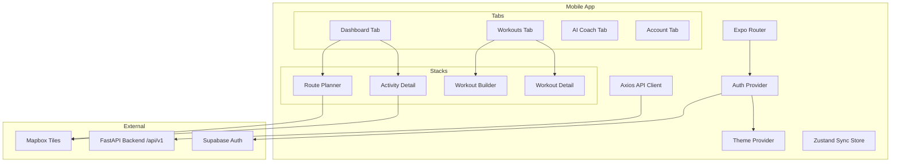
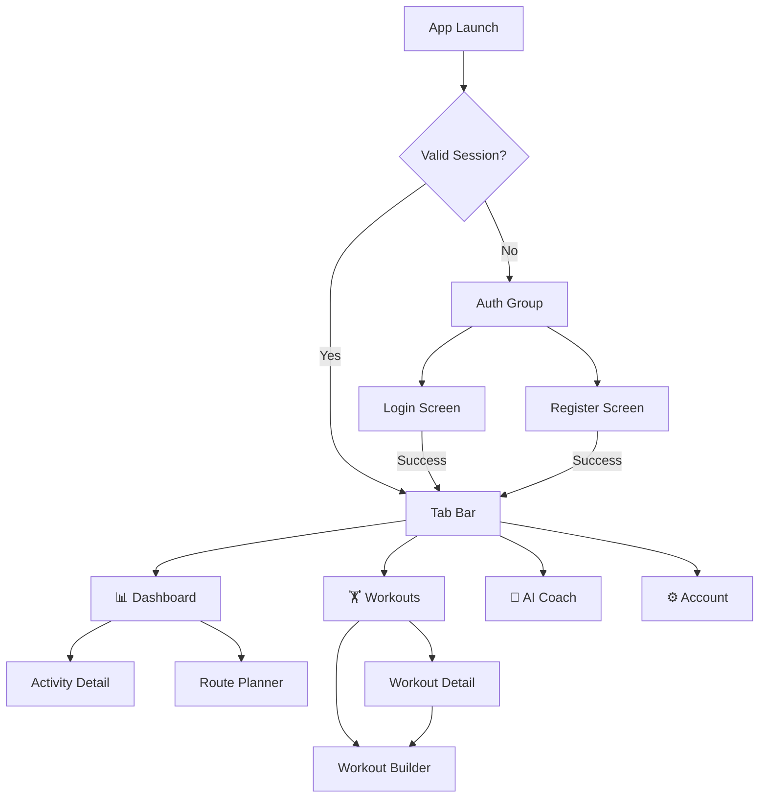

# Design Document: Expo Mobile Rewrite

## Overview

This design describes the architecture for "TriCoach", an Expo (React Native) mobile app that replaces the existing Next.js web frontend. The mobile app lives in `mobile/` at the repository root and consumes the same FastAPI backend API unchanged. The primary target is iOS.

The mobile app preserves all user-facing functionality from the web app — dashboard with coach briefing, activity feed with detail views, AI coach chat with SSE streaming, training plan management with weekly/monthly calendars, structured workout builder, map-based route planner, and Garmin connection management — adapted for native mobile UX patterns (tab navigation, pull-to-refresh, native gestures, platform maps and charts).

### Key Design Decisions

1. **Expo Router (file-based routing)** over React Navigation manual configuration — aligns with the web app's file-based routing convention and simplifies navigation structure.
2. **Axios with JWT interceptor** ported from the web app — maintains identical API client patterns, making the port straightforward and keeping auth handling consistent.
3. **Zustand for global state** over React Context — lightweight, no provider nesting, works well for the global sync state that needs to be accessed from any screen.
4. **`victory-native`** for charts — built on `react-native-skia`, provides the line charts, bar charts, and dual-axis support needed for fitness/recovery visualisations with touch tooltips.
5. **`@rnmapbox/maps`** for maps — required for Mapbox tile rendering and waypoint interaction in the route planner.
6. **SSE via `react-native-sse`** for coach chat streaming — the backend streams `text/event-stream` responses, and this library provides a clean EventSource API for React Native.
7. **Light/dark theme via `useColorScheme`** — follows device system setting with a theme context that provides colour tokens to all components.

## Architecture

### High-Level Architecture



### File Structure

```
mobile/
├── app/                          # Expo Router file-based routes
│   ├── _layout.tsx               # Root layout: providers (auth, theme, sync)
│   ├── (auth)/                   # Unauthenticated route group
│   │   ├── _layout.tsx           # Auth layout (no tab bar)
│   │   ├── login.tsx             # Login screen
│   │   └── register.tsx          # Register screen
│   ├── (tabs)/                   # Authenticated tab group
│   │   ├── _layout.tsx           # Tab bar layout (4 tabs)
│   │   ├── index.tsx             # Dashboard tab (redirects or is dashboard)
│   │   ├── dashboard/
│   │   │   ├── _layout.tsx       # Dashboard stack
│   │   │   ├── index.tsx         # Dashboard screen
│   │   │   ├── activity/
│   │   │   │   └── [id].tsx      # Activity detail screen
│   │   │   └── routes.tsx        # Route planner screen
│   │   ├── workouts/
│   │   │   ├── _layout.tsx       # Workouts stack
│   │   │   ├── index.tsx         # Workout hub (plan + calendar)
│   │   │   ├── [id].tsx          # Workout detail screen
│   │   │   └── builder.tsx       # Workout builder screen
│   │   ├── coach.tsx             # AI Coach chat screen
│   │   └── account.tsx           # Account screen (Garmin + profile)
├── components/                   # Shared components
│   ├── ui/                       # Primitive UI components
│   │   ├── Card.tsx
│   │   ├── Button.tsx
│   │   ├── Input.tsx
│   │   ├── Badge.tsx
│   │   ├── Skeleton.tsx
│   │   └── Alert.tsx
│   ├── charts/                   # Chart components
│   │   ├── RecoveryTrendChart.tsx
│   │   ├── FitnessFormChart.tsx
│   │   └── HRZoneChart.tsx
│   ├── maps/                     # Map components
│   │   ├── ActivityMap.tsx
│   │   └── RoutePlannerMap.tsx
│   ├── dashboard/                # Dashboard section components
│   │   ├── BriefingCard.tsx
│   │   ├── RecoveryOverview.tsx
│   │   ├── ActivityOverview.tsx
│   │   ├── UpcomingWorkouts.tsx
│   │   ├── SyncStatusBar.tsx
│   │   └── MetricTile.tsx
│   ├── workouts/                 # Workout-specific components
│   │   ├── WeeklyCalendar.tsx
│   │   ├── MonthlyCalendar.tsx
│   │   ├── WorkoutCard.tsx
│   │   ├── WorkoutDetailModal.tsx
│   │   ├── PhaseIndicator.tsx
│   │   ├── RacesSection.tsx
│   │   ├── EnduranceBuilder.tsx
│   │   ├── StrengthBuilder.tsx
│   │   └── YogaBuilder.tsx
│   ├── activities/               # Activity-specific components
│   │   ├── ActivityListItem.tsx
│   │   ├── DisciplineFilter.tsx
│   │   ├── LapTable.tsx
│   │   └── ExerciseList.tsx
│   └── account/                  # Account-specific components
│       ├── GarminConnectCard.tsx
│       └── AthleteProfileForm.tsx
├── lib/                          # Shared utilities
│   ├── api.ts                    # Axios instance + JWT interceptor
│   ├── supabase.ts               # Supabase client (AsyncStorage)
│   ├── types.ts                  # TypeScript types (ported from web)
│   ├── format.ts                 # Formatting utilities (ported from web)
│   ├── polyline.ts               # Polyline decode utility
│   ├── error-handling.ts         # Error extraction utilities
│   └── theme.ts                  # Theme colours and tokens
├── stores/                       # Zustand stores
│   └── sync-store.ts             # Global Garmin sync state
├── hooks/                        # Custom hooks
│   ├── useAuth.ts                # Auth state hook
│   ├── useSyncState.ts           # Sync state hook (wraps Zustand)
│   └── useRefreshOnSync.ts       # Auto-refresh when sync completes
├── app.json                      # Expo config
├── tsconfig.json
├── package.json
├── babel.config.js
└── .env                          # Environment variables
```

### Navigation Flow



## Components and Interfaces

### Auth Provider

The root layout wraps the app in an auth provider that manages Supabase session state and controls which route group is visible.

```typescript
// app/_layout.tsx
interface AuthState {
  session: Session | null;
  loading: boolean;
  signIn: (email: string, password: string) => Promise<void>;
  signUp: (email: string, password: string, name?: string) => Promise<void>;
  signOut: () => Promise<void>;
}
```

The Supabase client is initialised with `AsyncStorage` for session persistence:

```typescript
// lib/supabase.ts
import AsyncStorage from "@react-native-async-storage/async-storage";
import { createClient } from "@supabase/supabase-js";

export const supabase = createClient(
  process.env.EXPO_PUBLIC_SUPABASE_URL!,
  process.env.EXPO_PUBLIC_SUPABASE_ANON_KEY!,
  {
    auth: {
      storage: AsyncStorage,
      autoRefreshToken: true,
      persistSession: true,
      detectSessionInUrl: false,
    },
  }
);
```

### API Client

Ported from the web app's `lib/api.ts`. The key difference is that the mobile client reads the token from the Supabase client directly (no SSR considerations) and uses the full backend URL (no Next.js proxy).

```typescript
// lib/api.ts
import axios, { AxiosHeaders } from "axios";
import { supabase } from "./supabase";

const API_URL = process.env.EXPO_PUBLIC_API_URL!;

export const api = axios.create({
  baseURL: `${API_URL}/api/v1`,
  headers: { "Content-Type": "application/json" },
});

// Request interceptor: attach JWT
api.interceptors.request.use(async (config) => {
  const { data: { session } } = await supabase.auth.getSession();
  if (session?.access_token) {
    const headers = AxiosHeaders.from(config.headers ?? {});
    headers.set("Authorization", `Bearer ${session.access_token}`);
    config.headers = headers;
  }
  return config;
});

// Response interceptor: handle 401
api.interceptors.response.use(
  (res) => res,
  async (err) => {
    if (err.response?.status === 401) {
      await supabase.auth.signOut();
      // Navigation to login is handled by the auth provider
      // reacting to the session change
    }
    return Promise.reject(err);
  }
);
```

### Garmin Sync Store (Zustand)

Replaces the web app's `useSyncExternalStore` + custom events pattern with a simpler Zustand store. The store is global and accessible from any screen without provider nesting.

```typescript
// stores/sync-store.ts
import { create } from "zustand";

interface SyncState {
  isSyncing: boolean;
  lastCompletedAt: number | null;
  lastResult: { activitiesSynced: number; healthDaysSynced: number } | null;
  lastError: string | null;
  syncVersion: number; // incremented on completion to trigger re-fetches

  startSync: () => boolean; // returns false if already syncing
  completedSync: (result: { activitiesSynced: number; healthDaysSynced: number }) => void;
  failSync: (error: string) => void;
}

export const useSyncStore = create<SyncState>((set, get) => ({
  isSyncing: false,
  lastCompletedAt: null,
  lastResult: null,
  lastError: null,
  syncVersion: 0,

  startSync: () => {
    if (get().isSyncing) return false;
    set({ isSyncing: true, lastError: null });
    return true;
  },
  completedSync: (result) =>
    set((s) => ({
      isSyncing: false,
      lastCompletedAt: Date.now(),
      lastResult: result,
      lastError: null,
      syncVersion: s.syncVersion + 1,
    })),
  failSync: (error) =>
    set({ isSyncing: false, lastError: error }),
}));
```

Screens subscribe to `syncVersion` to know when to re-fetch data:

```typescript
// hooks/useRefreshOnSync.ts
import { useEffect, useRef } from "react";
import { useSyncStore } from "../stores/sync-store";

export function useRefreshOnSync(onRefresh: () => void) {
  const syncVersion = useSyncStore((s) => s.syncVersion);
  const prevVersion = useRef(syncVersion);

  useEffect(() => {
    if (syncVersion > prevVersion.current) {
      prevVersion.current = syncVersion;
      onRefresh();
    }
  }, [syncVersion, onRefresh]);
}
```

### Theme System

The theme follows the device system setting and provides colour tokens consistent with the web app's CSS custom properties.

```typescript
// lib/theme.ts
import { useColorScheme } from "react-native";

export const lightColors = {
  background: "#ffffff",
  foreground: "#0a0a0a",
  card: "#ffffff",
  cardBorder: "#e5e5e5",
  primary: "#2563eb",
  primaryForeground: "#ffffff",
  muted: "#f5f5f5",
  mutedForeground: "#737373",
  destructive: "#ef4444",
  statusPositive: "#10b981",
  statusNegative: "#ef4444",
  statusCaution: "#f59e0b",
  // Discipline colours
  disciplineRun: "#f97316",
  disciplineSwim: "#3b82f6",
  disciplineRideRoad: "#8b5cf6",
  disciplineRideGravel: "#f59e0b",
  disciplineStrength: "#f43f5e",
  disciplineYoga: "#14b8a6",
  disciplineMobility: "#06b6d4",
};

export const darkColors: typeof lightColors = {
  background: "#0a0a0a",
  foreground: "#fafafa",
  card: "#171717",
  cardBorder: "#262626",
  primary: "#3b82f6",
  primaryForeground: "#ffffff",
  muted: "#262626",
  mutedForeground: "#a3a3a3",
  destructive: "#ef4444",
  statusPositive: "#34d399",
  statusNegative: "#f87171",
  statusCaution: "#fbbf24",
  disciplineRun: "#fb923c",
  disciplineSwim: "#60a5fa",
  disciplineRideRoad: "#a78bfa",
  disciplineRideGravel: "#fbbf24",
  disciplineStrength: "#fb7185",
  disciplineYoga: "#2dd4bf",
  disciplineMobility: "#22d3ee",
};

export function useThemeColors() {
  const scheme = useColorScheme();
  return scheme === "dark" ? darkColors : lightColors;
}
```

### SSE Streaming for Coach Chat

The coach chat uses SSE streaming. On React Native, we use `react-native-sse` which provides an `EventSource`-like API, or fall back to a manual `fetch` + `ReadableStream` approach similar to the web app.

```typescript
// Simplified streaming approach using fetch (works in React Native with Hermes)
async function streamChat(
  message: string,
  onToken: (token: string) => void,
  signal?: AbortSignal
): Promise<void> {
  const { data: { session } } = await supabase.auth.getSession();
  const response = await fetch(`${API_URL}/api/v1/coach/chat`, {
    method: "POST",
    headers: {
      "Content-Type": "application/json",
      Authorization: `Bearer ${session?.access_token}`,
    },
    body: JSON.stringify({ message }),
    signal,
  });

  if (!response.ok) throw new Error("Chat request failed");
  if (!response.body) throw new Error("No stream body");

  const reader = response.body.getReader();
  const decoder = new TextDecoder();

  while (true) {
    const { done, value } = await reader.read();
    if (done) break;
    const chunk = decoder.decode(value, { stream: true });
    for (const line of chunk.split("\n")) {
      if (line.startsWith("data: ")) {
        const data = line.slice(6).trim();
        if (data === "[DONE]") continue;
        try {
          const parsed = JSON.parse(data);
          if (parsed.token) onToken(parsed.token);
        } catch {
          // non-JSON SSE line
        }
      }
    }
  }
}
```

### Chart Components

Charts use `victory-native` with `react-native-skia` for performant rendering. Each chart component wraps Victory primitives with the app's theme colours.

```typescript
// components/charts/FitnessFormChart.tsx — interface
interface FitnessFormChartProps {
  data: FitnessPoint[];  // { date, ctl, atl, tsb, daily_tss }
  height?: number;
}

// components/charts/RecoveryTrendChart.tsx — interface
interface RecoveryTrendChartProps {
  data: HealthSparklinePoint[];  // { date, sleep_score, hrv, resting_hr, ... }
  height?: number;
}

// components/charts/HRZoneChart.tsx — interface
interface HRZoneChartProps {
  zones: Record<string, number>;  // zone label → percentage or duration
  height?: number;
}
```

### Map Components

Maps use `@rnmapbox/maps` for Mapbox rendering. The `ActivityMap` component decodes the backend's encoded polyline and renders it as a `ShapeSource` + `LineLayer`.

```typescript
// components/maps/ActivityMap.tsx — interface
interface ActivityMapProps {
  polyline: string;  // encoded polyline from backend
  height?: number;
}

// components/maps/RoutePlannerMap.tsx — interface
interface RoutePlannerMapProps {
  waypoints: Array<{ latitude: number; longitude: number }>;
  routePolyline?: string;
  activityType: "running" | "road_cycling" | "gravel_cycling";
  onWaypointAdd: (coord: { latitude: number; longitude: number }) => void;
  onWaypointRemove: (index: number) => void;
}
```

### Polyline Utilities

```typescript
// lib/polyline.ts
/** Decode a Google-encoded polyline string into coordinate pairs. */
export function decodePolyline(encoded: string): Array<[number, number]> {
  // Standard Google polyline decoding algorithm
  // Returns array of [latitude, longitude] pairs
}

/** Compute bounding box from coordinate pairs for camera fitting. */
export function computeBounds(
  coords: Array<[number, number]>
): { ne: [number, number]; sw: [number, number] } {
  // Returns northeast and southwest corners
}
```

### Screen Component Interfaces

Each screen follows a consistent pattern: fetch data on mount, show skeleton while loading, support pull-to-refresh, and auto-refresh when a Garmin sync completes.

```typescript
// Typical screen pattern
function DashboardScreen() {
  const [data, setData] = useState<DashboardOverview | null>(null);
  const [loading, setLoading] = useState(true);
  const [error, setError] = useState<string | null>(null);
  const colors = useThemeColors();

  const fetchData = useCallback(async () => {
    const tz = Intl.DateTimeFormat().resolvedOptions().timeZone;
    const res = await api.get<DashboardOverview>("/dashboard/overview", {
      headers: { "X-User-Timezone": tz },
    });
    setData(res.data);
  }, []);

  useRefreshOnSync(fetchData);

  // ... render with ScrollView + RefreshControl
}
```

## Data Models

All TypeScript types are ported from the web frontend's `lib/types.ts`. The mobile `types.ts` is identical except for removal of any web-only types. Key types used across the app:

### Core Types (ported from web)

```typescript
// lib/types.ts — key types (identical to web frontend)

export type Discipline =
  | "SWIM" | "RUN" | "RIDE_ROAD" | "RIDE_GRAVEL"
  | "STRENGTH" | "YOGA" | "MOBILITY" | "OTHER";

export interface ActivitySummary {
  id: string;
  garmin_activity_id: number | null;
  discipline: Discipline;
  name: string | null;
  start_time: string;
  duration_seconds: number | null;
  calories: number | null;
  distance_meters: number | null;
  elevation_gain_meters: number | null;
  avg_hr: number | null;
  avg_pace_sec_per_km: number | null;
  avg_power_watts: number | null;
  tss: number | null;
  total_sets: number | null;
  total_volume_kg: number | null;
  session_type: string | null;
  aerobic_training_effect: number | null;
  anaerobic_training_effect: number | null;
  training_effect_label: string | null;
}

export interface DashboardOverview {
  generated_at: string;
  timezone: string;
  last_sync_at: string | null;
  recovery: RecoveryOverview & { sparkline: HealthSparklinePoint[] };
  activity: ActivityOverview;
  briefing: DashboardBriefing | null;
  recent_activities: ActivitySummary[];
  upcoming_workouts: PlannedWorkout[];
  fitness_timeline: FitnessPoint[];
}

export interface AthleteProfile {
  ftp_watts: number | null;
  threshold_pace_sec_per_km: number | null;
  swim_css_sec_per_100m: number | null;
  max_hr: number | null;
  resting_hr: number | null;
  weight_kg: number | null;
  squat_1rm_kg: number | null;
  deadlift_1rm_kg: number | null;
  bench_1rm_kg: number | null;
  overhead_press_1rm_kg: number | null;
  mobility_sessions_per_week_target: number;
  weekly_training_hours: number | null;
  notes: string | null;
  field_sources: Record<string, "manual" | "garmin" | "default">;
  garmin_values: Record<string, number | null>;
}

// Full type file also includes: DashboardBriefing, RecoveryOverview,
// RecoveryLastNight, RecoveryMetricTrend, ActivityOverview,
// HealthSparklinePoint, FitnessPoint, TrainingPlan, PlanStructure,
// PlanPhase, PlanWorkout, Goal, Workout, PlannedWorkout, etc.
```

### Mobile-Specific Types

```typescript
// Additional types for mobile-only concerns

export interface GarminStatus {
  connected: boolean;
  garmin_email: string | null;
  last_sync_at: string | null;
  session_status?: "valid" | "expired" | "not_connected";
}

export interface GarminSyncResponse {
  activities_synced: number;
  activity_files_synced?: number;
  health_days_synced: number;
  missing_health_metrics?: string[];
}

export interface ChatMessage {
  role: "user" | "assistant";
  content: string;
}

export type WorkoutStatus = "completed" | "today" | "skipped" | "upcoming";
```

### API Endpoint Map

All endpoints consumed by the mobile app, matching the existing FastAPI backend:

| Endpoint | Method | Used By | Notes |
|---|---|---|---|
| `/dashboard/overview` | GET | Dashboard | Requires `X-User-Timezone` header |
| `/activities` | GET | Activity Feed | Supports `discipline`, `limit`, `offset` query params |
| `/activities/{id}` | GET | Activity Detail | Full activity with polyline, laps, HR zones |
| `/activities/profile/athlete` | GET | Account | Athlete profile with field sources |
| `/activities/profile/athlete` | PUT | Account | Update athlete profile |
| `/coach/history` | GET | Coach Chat | Conversation history |
| `/coach/history` | DELETE | Coach Chat | Clear conversation |
| `/coach/chat` | POST | Coach Chat | SSE streaming response |
| `/coach/goals` | GET | Workout Hub | Active goals/races |
| `/coach/goals` | POST | Workout Hub | Create goal/race |
| `/coach/goals/{id}` | DELETE | Workout Hub | Delete goal/race |
| `/plans` | GET | Workout Hub | All training plans |
| `/plans/{id}` | GET | Workout Hub | Plan with workouts + completion status |
| `/plans/generate` | POST | Workout Hub | AI plan generation |
| `/plans/{id}/week-briefing/{week}` | GET | Workout Hub | Weekly coach briefing |
| `/plans/{id}/enrich-week/{week}` | POST | Workout Hub | Generate detailed workout programs |
| `/plans/{id}/sync-garmin` | POST | Workout Hub | Sync workouts to Garmin |
| `/workouts` | POST | Workout Builder | Create workout |
| `/workouts/{id}` | GET | Workout Detail | Single workout |
| `/workouts/{id}` | PUT | Workout Builder | Update workout |
| `/workouts/{id}` | DELETE | Workout Hub | Delete workout |
| `/garmin/status` | GET | Account | Connection status |
| `/garmin/connect-and-sync` | POST | Account | Connect + initial sync |
| `/garmin/connect/token-store` | POST | Account | Token import |
| `/garmin/disconnect` | DELETE | Account | Disconnect |
| `/sync/now` | POST | Account, Dashboard | Full sync with `X-User-Timezone` |
| `/sync/quick` | POST | Dashboard | Quick sync from last sync date |


## Correctness Properties

*A property is a characteristic or behavior that should hold true across all valid executions of a system — essentially, a formal statement about what the system should do. Properties serve as the bridge between human-readable specifications and machine-verifiable correctness guarantees.*

### Property 1: API client attaches Bearer token on every request

*For any* Axios request config and any valid Supabase session, the request interceptor SHALL attach the session's access token as a `Bearer` token in the `Authorization` header.

**Validates: Requirements 3.2**

### Property 2: Activity list item displays all required fields

*For any* valid `ActivitySummary` object with non-null fields, the rendered activity list item SHALL contain the discipline emoji icon, activity name, formatted date, formatted duration, formatted distance (when `distance_meters` is non-null), and formatted average heart rate (when `avg_hr` is non-null).

**Validates: Requirements 6.2**

### Property 3: Activity detail displays all non-null key metrics

*For any* valid `ActivityDetail` object, the rendered detail screen SHALL display every non-null metric from the set: duration, distance, elevation gain, average HR, max HR, average pace or power, cadence, TSS, and training effect.

**Validates: Requirements 6.10**

### Property 4: Assistant messages render as formatted Markdown

*For any* valid Markdown string in an assistant chat message, the rendered output SHALL contain the formatted content (headings, bold, lists, code) rather than raw Markdown syntax characters.

**Validates: Requirements 7.3**

### Property 5: Workouts are placed in the correct day column

*For any* set of `PlanWorkout` objects with `plan_day` values in the range 0–6, each workout SHALL appear in the day column corresponding to its `plan_day` value in the weekly calendar grid.

**Validates: Requirements 8.4**

### Property 6: Workout builder duration and volume summaries are correct

*For any* set of endurance workout steps with `duration_min` values, the displayed total estimated duration SHALL equal the sum of all step durations. *For any* set of strength exercises with sets, reps, and weight values, the displayed total volume SHALL equal the sum of `sets × reps × weight` across all exercises.

**Validates: Requirements 9.8**

### Property 7: Athlete profile source badges match field_sources

*For any* `AthleteProfile` with a `field_sources` map, each rendered profile field SHALL display a source badge ("Manual", "Garmin", or "Default") matching the value in `field_sources` for that field's key.

**Validates: Requirements 12.8**

### Property 8: Sync guard prevents concurrent syncs

*For any* sync state where `isSyncing` is `true`, calling `startSync()` SHALL return `false` and SHALL NOT modify the sync state (no second concurrent sync is started).

**Validates: Requirements 13.5**

### Property 9: Polyline decode round-trip preserves coordinates

*For any* valid list of latitude/longitude coordinate pairs, encoding then decoding the polyline SHALL produce coordinates within ±0.00001 degrees of the original values (standard Google polyline precision of 5 decimal places).

**Validates: Requirements 15.2**

### Property 10: Bounding box contains all coordinates

*For any* non-empty list of latitude/longitude coordinate pairs, the computed bounding box SHALL contain every coordinate — i.e., for each coordinate, `sw.lat ≤ lat ≤ ne.lat` and `sw.lng ≤ lng ≤ ne.lng`.

**Validates: Requirements 15.3**

### Property 11: Format functions produce identical output to web frontend

*For any* valid input value, the mobile `formatDuration(seconds)`, `formatDate(iso)`, `formatNumber(value, unit)`, `formatHRV(hrv)`, and `formatSleepScore(score)` functions SHALL produce identical string output to the web frontend's corresponding functions.

**Validates: Requirements 16.2**

### Property 12: getDisciplineMeta returns valid data for all disciplines

*For any* value in the `Discipline` enum (`SWIM | RUN | RIDE_ROAD | RIDE_GRAVEL | STRENGTH | YOGA | MOBILITY | OTHER`), `getDisciplineMeta` SHALL return an object with a non-empty `label` string, a non-empty `icon` string (emoji), and a non-empty `color` string (React Native colour value).

**Validates: Requirements 16.3**

### Property 13: Error extraction returns backend detail message

*For any* Axios error response object containing a `response.data.detail` string, `extractApiError` SHALL return an `ApiError` whose `message` field equals that `detail` string.

**Validates: Requirements 17.2**

## Error Handling

### Strategy

Error handling follows a layered approach:

1. **API Client Layer** — The Axios response interceptor catches HTTP 401 globally and triggers sign-out + navigation to login. All other errors propagate to the calling screen.

2. **Screen Layer** — Each screen wraps API calls in try/catch and uses `extractApiError()` (ported from the web app's `lib/error-handling.ts`) to normalise error shapes. Errors are displayed inline using an `Alert` component, never as native alerts.

3. **Pull-to-Refresh Resilience** — When a refresh fails, the error is displayed but previously loaded data is preserved. The screen never goes blank on a failed refresh.

4. **Network Errors** — Network failures (no connectivity) show a user-friendly message ("Unable to connect. Check your internet connection.") with a "Retry" button that re-invokes the failed request.

### Error Extraction Utility

```typescript
// lib/error-handling.ts (ported from web)
export interface ApiError {
  status?: number;
  message: string;
  detail?: string;
}

export function extractApiError(error: unknown): ApiError {
  const axiosErr = error as {
    response?: { status?: number; data?: { detail?: string } };
    message?: string;
  };
  if (axiosErr?.response) {
    const detail = axiosErr.response.data?.detail;
    return {
      status: axiosErr.response.status,
      message: detail ?? axiosErr.message ?? "Request failed",
      detail,
    };
  }
  if (error instanceof Error) {
    return { message: error.message };
  }
  return { message: "An unknown error occurred" };
}
```

### Garmin Sync Error Handling

Garmin sync errors are handled through the Zustand sync store. When a sync fails:
1. The store's `lastError` is set with the error message
2. Any screen showing a sync button displays the error inline
3. The sync guard (`isSyncing`) is released so the user can retry
4. Garmin auth errors (session expired) show a specific message directing the user to reconnect in Account

### SSE Streaming Error Handling

Coach chat streaming errors are handled gracefully:
1. If the initial `fetch` fails, an error message replaces the assistant's typing indicator
2. If the stream breaks mid-response, the partial response is kept and an error note is appended
3. The user can send a new message to retry
4. An `AbortController` allows cancelling in-flight streams when the user navigates away

## Testing Strategy

### Dual Testing Approach

The mobile app uses both unit tests and property-based tests for comprehensive coverage:

- **Unit tests** (Jest + React Native Testing Library): Specific examples, edge cases, integration points, component rendering
- **Property-based tests** (fast-check): Universal properties across all valid inputs for pure functions and data transformations

### Property-Based Testing Configuration

- **Library**: `fast-check` (JavaScript/TypeScript PBT library)
- **Minimum iterations**: 100 per property test
- **Tag format**: `Feature: expo-mobile-rewrite, Property {number}: {property_text}`

### Test Organisation

```
mobile/
├── __tests__/
│   ├── lib/
│   │   ├── api.test.ts              # Properties 1 (JWT interceptor)
│   │   ├── format.test.ts           # Properties 11, 12 (format functions)
│   │   ├── format.property.test.ts  # PBT for format equivalence
│   │   ├── polyline.test.ts         # Properties 9, 10 (polyline utils)
│   │   ├── polyline.property.test.ts # PBT for polyline round-trip
│   │   ├── error-handling.test.ts   # Property 13 (error extraction)
│   │   └── error-handling.property.test.ts # PBT for error extraction
│   ├── stores/
│   │   ├── sync-store.test.ts       # Property 8 (sync guard)
│   │   └── sync-store.property.test.ts # PBT for sync guard
│   ├── components/
│   │   ├── activities/
│   │   │   └── ActivityListItem.test.tsx  # Property 2 (activity display)
│   │   ├── workouts/
│   │   │   ├── WeeklyCalendar.test.tsx    # Property 5 (day placement)
│   │   │   └── WorkoutBuilder.test.tsx    # Property 6 (duration/volume)
│   │   ├── account/
│   │   │   └── AthleteProfileForm.test.tsx # Property 7 (source badges)
│   │   └── charts/
│   │       └── HRZoneChart.test.tsx
│   └── screens/
│       ├── dashboard.test.tsx       # Dashboard rendering + loading states
│       ├── coach.test.tsx           # Chat rendering + streaming
│       ├── login.test.tsx           # Auth flow
│       └── activity-detail.test.tsx # Property 3 (metric display)
```

### Unit Test Coverage Priorities

1. **Auth flow**: Login, register, session persistence, 401 handling
2. **API client**: Interceptor behaviour, error handling
3. **Dashboard**: Section rendering with mock data, skeleton states, pull-to-refresh
4. **Coach chat**: Message rendering, SSE token accumulation, suggested prompts
5. **Workout hub**: Calendar rendering, week navigation, workout status classification
6. **Account**: Garmin connection states, profile form rendering

### Property Test Coverage

Each correctness property (1–13) gets a dedicated property-based test file using `fast-check` with minimum 100 iterations. Properties are tagged with comments referencing the design document property number.

### Integration Test Approach

Integration tests verify API call correctness (correct endpoints, headers, payloads) using mocked Axios responses. These are example-based tests, not property-based, since they test wiring rather than logic.
