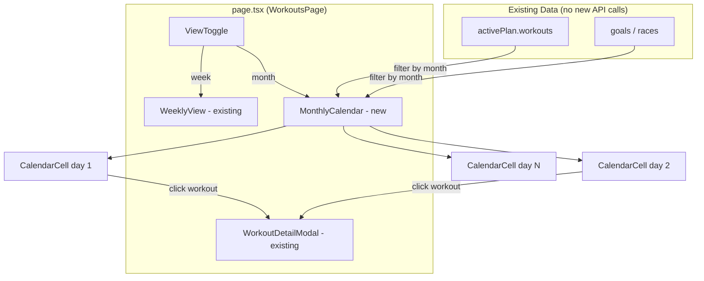

# Design Document: Monthly Calendar View

## Overview

This feature replaces the standalone plan pages (`/workouts/plan` and `/workouts/plan/[id]`) with an inline monthly calendar view on the main `/workouts` page. A toggle lets athletes switch between the existing weekly grid and a new Garmin Connect–style monthly calendar showing workouts on their scheduled dates with discipline icons, duration, TSS, and race markers. Month navigation (prev/next/today) enables browsing the full plan timeline. Clicking a workout opens the existing detail modal.

All data is already available client-side — the `PlanWithWorkouts` API response contains every workout with `scheduled_date`, and goals (races) have `target_date`. No new backend endpoints are needed. The implementation is purely frontend: new React components co-located in the workouts folder, a view toggle, calendar grid logic, and removal of the standalone plan pages.

### Design Decisions

1. **Client-side calendar math** — Calendar grid generation (first day of month, padding days, row count) is implemented as pure utility functions rather than pulling in a date library. The logic is straightforward (ISO week starts Monday) and keeps the bundle lean.
2. **State via URL search params** — The selected view mode (`week`/`month`) and current month are stored in URL search params so that browser back/forward and link sharing work naturally. `useSearchParams` from Next.js App Router handles this.
3. **Reuse existing workout modal** — The `selectedWorkout` state and `Dialog` already exist in `page.tsx`. The monthly view dispatches the same `setSelectedWorkout` callback, so no modal duplication is needed.
4. **Co-located components** — Following the project convention, `MonthlyCalendar`, `CalendarCell`, and `ViewToggle` live alongside `page.tsx` in `frontend/app/(app)/workouts/`.

## Architecture



### Component Hierarchy

```
WorkoutsPage (page.tsx)
├── PhaseIndicator (existing)
├── CoachBriefing (existing)
├── ViewToggle (new)
├── WeeklyView (existing, shown when view=week)
│   ├── WeekNavigation (existing)
│   └── 7-column grid (existing)
├── MonthlyCalendar (new, shown when view=month)
│   ├── MonthNavigator (prev / next / today + month/year header)
│   └── CalendarGrid (7 columns × 4-6 rows)
│       └── CalendarCell (per day)
│           ├── WorkoutCard (compact, per workout)
│           └── RaceMarker (per race on that date)
├── RacesSection (existing)
└── WorkoutDetailModal (existing Dialog)
```

## Components and Interfaces

### ViewToggle

A segmented control offering "Week" and "Month" options. Only rendered when an active plan exists.

```typescript
interface ViewToggleProps {
  value: "week" | "month";
  onChange: (view: "week" | "month") => void;
}
```

Implementation: Two buttons styled as a segmented control using Tailwind classes and `cn()`. The active segment gets `bg-primary text-primary-foreground`; the inactive gets `text-muted-foreground`. Renders inline in the header area between the phase indicator and the calendar.

### MonthlyCalendar

The main monthly view container. Receives the full workout list and goals, filters them to the displayed month, and renders the grid.

```typescript
interface MonthlyCalendarProps {
  workouts: PlanWorkoutResponse[];
  races: Goal[];
  currentMonth: Date; // first day of the displayed month
  onMonthChange: (month: Date) => void;
  onWorkoutClick: (workout: PlanWorkoutResponse) => void;
}
```

Responsibilities:
- Render the `MonthNavigator` (prev/next/today buttons + "July 2025" header)
- Compute the calendar grid: find the Monday on or before the 1st, generate 4–6 rows of 7 days
- Build a lookup map: `Record<string, { workouts: PlanWorkoutResponse[], races: Goal[] }>` keyed by `YYYY-MM-DD`
- Render day-of-week column headers (Mon–Sun)
- Render `CalendarCell` for each day in the grid

### MonthNavigator

Navigation controls for the monthly view.

```typescript
interface MonthNavigatorProps {
  currentMonth: Date;
  onPrev: () => void;
  onNext: () => void;
  onToday: () => void;
}
```

Renders: `← Prev` button, `Next →` button, `Today` button, and the month/year label (e.g. "July 2025"). Layout mirrors the existing week navigation pattern.

### CalendarCell

A single day cell in the monthly grid.

```typescript
interface CalendarCellProps {
  date: Date;
  isCurrentMonth: boolean;
  isToday: boolean;
  workouts: PlanWorkoutResponse[];
  races: Goal[];
  onWorkoutClick: (workout: PlanWorkoutResponse) => void;
}
```

Rendering rules:
- Date number displayed in the top-left corner
- Out-of-month cells: muted text and background (`text-muted-foreground bg-muted/20`)
- Today cell: primary color left border or ring (`border-l-2 border-primary` or `ring-1 ring-primary`)
- Race markers render above workout cards
- Workout cards stack vertically within the cell
- Past-date workout cards get muted styling (`opacity-60`)

### WorkoutCard (compact, monthly variant)

A compact workout indicator for the monthly grid. Smaller than the weekly view cards since space is limited.

```typescript
// No separate component needed — rendered inline in CalendarCell
// Shows: discipline icon + duration + TSS (single line)
```

Rendering: A single-line `<button>` per workout showing `🏊 45m · 55 TSS`. Clicking triggers `onWorkoutClick`. Uses `text-[10px]` or `text-xs` sizing to fit within the constrained cell.

### RaceMarker

A visually distinct indicator for race dates.

```typescript
// Rendered inline in CalendarCell when races exist for that date
// Shows: accent-colored badge with race description
```

Rendering: A small badge with `bg-amber-500/15 text-amber-600` (or similar accent) showing the race description truncated. Renders above workout cards in the cell.

### Calendar Grid Utility Functions

Pure functions for calendar math, extracted to a utility module for testability.

```typescript
// frontend/app/(app)/workouts/calendar-utils.ts

/** Get the Monday on or before the given date */
export function getMonday(date: Date): Date;

/** Generate the full grid of dates for a month view (4-6 weeks, Mon-Sun) */
export function getCalendarGrid(year: number, month: number): Date[][];

/** Format a Date as YYYY-MM-DD for lookup keys */
export function toDateKey(date: Date): string;

/** Build a lookup map from workouts array, keyed by YYYY-MM-DD */
export function buildWorkoutMap(
  workouts: PlanWorkoutResponse[]
): Record<string, PlanWorkoutResponse[]>;

/** Build a lookup map from races array, keyed by YYYY-MM-DD */
export function buildRaceMap(
  races: Goal[]
): Record<string, Goal[]>;

/** Format duration seconds as compact string: "1h30m" or "45m" */
export function formatDurationCompact(seconds: number | null): string;

/** Check if a date string is in the past (before today) */
export function isDatePast(dateStr: string): boolean;

/** Check if a date string is today */
export function isDateToday(dateStr: string): boolean;
```

## Data Models

No new backend models or API endpoints are needed. The feature uses existing data structures:

### Existing Types Used

```typescript
// From PlanWithWorkouts response (already loaded in page.tsx)
interface PlanWorkoutResponse {
  id: string;
  name: string;
  discipline: Discipline;
  scheduled_date: string | null;  // "YYYY-MM-DD" — used for calendar placement
  estimated_duration_seconds: number | null;
  estimated_tss: number | null;
  content: WorkoutContent | null;
  // ... other fields
}

// From goals (already loaded in page.tsx)
interface Goal {
  id: string;
  description: string;
  target_date: string | null;  // "YYYY-MM-DD" — used for race markers
  race_type: string | null;
  priority: number;
  // ... other fields
}
```

### Derived State

```typescript
// View mode — stored in component state, optionally synced to URL
type ViewMode = "week" | "month";

// Current month — stored as a Date representing the 1st of the displayed month
// Default: month containing today's date

// Calendar grid — computed from currentMonth via getCalendarGrid()
// Type: Date[][] (array of week arrays, each containing 7 Date objects)

// Workout lookup — computed from activePlan.workouts via buildWorkoutMap()
// Type: Record<string, PlanWorkoutResponse[]>

// Race lookup — computed from goals via buildRaceMap()
// Type: Record<string, Goal[]>
```

### Data Flow

1. `WorkoutsPage` loads `activePlan` (with all workouts) and `goals` on mount — **no change**
2. When view mode is "month", `MonthlyCalendar` receives the full `workouts` and `races` arrays
3. `MonthlyCalendar` computes `workoutMap` and `raceMap` via `useMemo` — O(n) scan, keyed by date
4. Each `CalendarCell` receives its day's workouts and races via map lookup — O(1)
5. Clicking a workout card calls `onWorkoutClick` → `setSelectedWorkout` → existing modal opens

## Correctness Properties

*A property is a characteristic or behavior that should hold true across all valid executions of a system — essentially, a formal statement about what the system should do. Properties serve as the bridge between human-readable specifications and machine-verifiable correctness guarantees.*

### Property 1: Calendar grid structure and date coverage

*For any* valid (year, month) pair, `getCalendarGrid(year, month)` SHALL return a grid with exactly 7 columns per row, between 4 and 6 rows, containing every day of the target month exactly once, where every date in the grid either belongs to the target month or is a padding date from an adjacent month, and all rows are contiguous (no gaps in the date sequence).

**Validates: Requirements 3.1, 3.4**

### Property 2: Duration formatting produces valid compact strings

*For any* positive integer `seconds`, `formatDurationCompact(seconds)` SHALL return a string matching the pattern `Xh`, `XhYm`, or `Xm` (where X and Y are positive integers), and the total minutes represented by the formatted string SHALL equal `Math.round(seconds / 60)`.

**Validates: Requirements 4.3**

### Property 3: Workout map preserves all workouts under correct date keys

*For any* array of workouts where each workout has a non-null `scheduled_date`, `buildWorkoutMap(workouts)` SHALL produce a map where: (a) every workout appears in exactly one entry keyed by its `scheduled_date`, (b) the sum of all entry lengths equals the input array length, and (c) no workout appears under a key different from its `scheduled_date`.

**Validates: Requirements 4.1, 4.5**

### Property 4: Race map preserves all races under correct date keys

*For any* array of goals where each goal has a non-null `target_date`, `buildRaceMap(goals)` SHALL produce a map where every goal appears in exactly one entry keyed by its `target_date`, and the sum of all entry lengths equals the input array length.

**Validates: Requirements 5.1**

### Property 5: Month navigation round-trip

*For any* valid (year, month) pair, navigating to the next month and then to the previous month SHALL return to the original (year, month). Symmetrically, navigating to the previous month and then to the next month SHALL also return to the original (year, month).

**Validates: Requirements 6.3, 6.4**

## Error Handling

This feature is entirely client-side with no new API calls, so error handling is minimal:

| Scenario | Handling |
|---|---|
| No active plan | View toggle is hidden; existing empty state renders (Req 8.1, 8.2) |
| Workout has null `scheduled_date` | Excluded from `buildWorkoutMap` — workout won't appear on calendar |
| Goal has null `target_date` | Excluded from `buildRaceMap` — race won't appear on calendar |
| Month with no workouts | Calendar grid renders normally with empty cells |
| Invalid date in workout data | `toDateKey` returns the raw string; cell lookup misses — workout silently omitted |
| Navigation to deleted `/workouts/plan` routes | Next.js returns 404 (files deleted) |

No loading spinners are needed for the monthly view since all data is already in memory from the initial page load. The existing loading skeleton in `WorkoutsPage` covers the initial data fetch.

## Testing Strategy

### Property-Based Tests (fast-check + Vitest)

The pure utility functions in `calendar-utils.ts` are ideal for property-based testing. They are pure functions with clear input/output behavior and a large input space (any year/month combination, any workout array).

- **Library**: `fast-check` (already in devDependencies)
- **Runner**: Vitest (`vitest run`)
- **Minimum iterations**: 100 per property
- **Test file**: `frontend/app/(app)/workouts/calendar-utils.test.ts`

Each property test references its design document property:

| Property | Test Tag |
|---|---|
| Property 1 | `Feature: monthly-calendar-view, Property 1: Calendar grid structure and date coverage` |
| Property 2 | `Feature: monthly-calendar-view, Property 2: Duration formatting produces valid compact strings` |
| Property 3 | `Feature: monthly-calendar-view, Property 3: Workout map preserves all workouts under correct date keys` |
| Property 4 | `Feature: monthly-calendar-view, Property 4: Race map preserves all races under correct date keys` |
| Property 5 | `Feature: monthly-calendar-view, Property 5: Month navigation round-trip` |

### Unit Tests (example-based, Vitest)

Example-based tests for specific scenarios and edge cases:

- **Calendar grid edge cases**: February in a leap year (2024), month starting on Monday (no padding), month starting on Sunday (6 padding days), December → January year boundary
- **View toggle**: Renders with active plan, hidden without active plan, defaults to "Week"
- **Workout card rendering**: Displays discipline icon, formatted duration, rounded TSS
- **Race marker rendering**: Distinct styling, displays above workout cards
- **Month navigation**: "Today" button navigates to current month, prev/next buttons update header
- **Workout click**: Opens detail modal with correct workout data
- **Empty states**: No-plan state hides toggle, shows races section

### Integration Tests

- **View switching**: Toggle between week and month preserves phase indicator and races section
- **Removed routes**: `/workouts/plan` and `/workouts/plan/[id]` return 404
- **"Full Plan View" link**: Removed from the workouts page header

