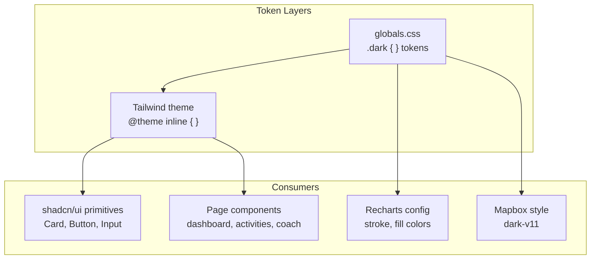

# Design Document

## Overview

This design transforms the TriCoach web app from a light-mode zinc/white aesthetic into a dark-mode-first premium design inspired by Oura and Whoop. The redesign is purely visual — no functionality changes, no new components, no backend modifications. Every change targets CSS custom properties in `globals.css`, Tailwind utility classes in component files, and Recharts/Mapbox configuration props.

The approach is layered:

1. **Foundation**: Redefine the `.dark` CSS custom properties in `globals.css` with oklch colors that have actual hue and chroma (the current dark tokens are achromatic grays). Add semantic status tokens and chart colors.
2. **Shell**: Update the app layout (`(app)/layout.tsx`) sidebar and header to use dark surfaces, accent-colored active states, and frosted-glass header.
3. **Components**: Update hardcoded light-mode Tailwind classes across all page components to use theme tokens (e.g. `bg-white` → `bg-card`, `text-zinc-900` → `text-foreground`).
4. **Charts**: Replace hardcoded Recharts color strings with dark-friendly luminous colors and transparent backgrounds.
5. **Maps**: Switch Mapbox styles from `outdoors-v12` to `dark-v11`.
6. **Polish**: Add gradient accents, glassmorphism surfaces, and glow effects.

The root layout (`app/layout.tsx`) gets the `dark` class on `<html>` so the app launches dark by default. The existing `:root` light-mode tokens are preserved untouched.

## Architecture

The redesign follows a token-driven architecture where all visual changes flow from CSS custom properties:



### Change Strategy

Changes fall into three categories:

**Category 1 — Token-level (globals.css only)**
Redefining `.dark` custom properties automatically updates all components that already use semantic tokens (`bg-card`, `text-foreground`, `border-border`, etc.). This covers shadcn/ui primitives (Card, Button, Input) with zero component-level changes.

**Category 2 — Hardcoded class replacement**
Many components use hardcoded light-mode classes like `bg-white`, `text-zinc-900`, `border-zinc-100`, `bg-zinc-50`. These must be replaced with semantic equivalents (`bg-card`, `text-foreground`, `border-border`, `bg-muted`). This is the bulk of the work.

**Category 3 — New visual features**
Gradient accents, glassmorphism surfaces, status color tokens, and chart color updates require new CSS custom properties and targeted class additions.

## Components and Interfaces

### 1. globals.css — Dark Token System

The `.dark` selector gets a complete overhaul. Current tokens are achromatic (zero chroma). New tokens introduce hue for depth and premium feel.

**Base surfaces** (cool-tinted near-black):
| Token | Current | New | Purpose |
|---|---|---|---|
| `--background` | `oklch(0.145 0 0)` | `oklch(0.13 0.008 270)` | Page background, cool-tinted black |
| `--card` | `oklch(0.205 0 0)` | `oklch(0.18 0.01 270)` | Card surfaces, elevated |
| `--popover` | `oklch(0.205 0 0)` | `oklch(0.20 0.012 270)` | Tooltips, dropdowns |
| `--muted` | `oklch(0.269 0 0)` | `oklch(0.22 0.01 270)` | Muted backgrounds, metric tiles |
| `--secondary` | `oklch(0.269 0 0)` | `oklch(0.24 0.012 270)` | Secondary surfaces |

**Accent** (cool violet):
| Token | Current | New | Purpose |
|---|---|---|---|
| `--primary` | `oklch(0.922 0 0)` | `oklch(0.55 0.2 270)` | Primary accent — cool violet |
| `--primary-foreground` | `oklch(0.205 0 0)` | `oklch(0.98 0 0)` | Text on primary |
| `--accent` | `oklch(0.269 0 0)` | `oklch(0.25 0.03 270)` | Accent surface (subtle violet tint) |
| `--accent-foreground` | `oklch(0.985 0 0)` | `oklch(0.95 0 0)` | Text on accent |
| `--ring` | `oklch(0.556 0 0)` | `oklch(0.55 0.2 270)` | Focus rings — matches primary |

**Foreground text tiers**:
| Token | New | Purpose |
|---|---|---|
| `--foreground` | `oklch(0.95 0.005 270)` | Primary text |
| `--muted-foreground` | `oklch(0.60 0.01 270)` | Secondary/muted text |
| `--card-foreground` | `oklch(0.95 0.005 270)` | Card text |

**Borders and inputs**:
| Token | New | Purpose |
|---|---|---|
| `--border` | `oklch(1 0 0 / 8%)` | Subtle white border |
| `--input` | `oklch(1 0 0 / 10%)` | Input field background |

**New semantic status tokens** (added to both `.dark` and `@theme inline`):
| Token | Value | Purpose |
|---|---|---|
| `--status-positive` | `oklch(0.75 0.15 180)` | Cyan/teal — strong, improving |
| `--status-caution` | `oklch(0.78 0.15 85)` | Amber/gold — steady, caution |
| `--status-negative` | `oklch(0.72 0.18 335)` | Magenta/rose — strained, negative |

**New chart color tokens**:
| Token | Value | Purpose |
|---|---|---|
| `--chart-1` | `oklch(0.70 0.15 265)` | Indigo/blue — primary metric |
| `--chart-2` | `oklch(0.75 0.15 180)` | Cyan/teal — positive indicator |
| `--chart-3` | `oklch(0.78 0.15 85)` | Amber — fatigue/caution |
| `--chart-4` | `oklch(0.72 0.18 335)` | Magenta — alert metric |
| `--chart-5` | `oklch(0.65 0.12 300)` | Purple — secondary metric |

**New gradient token**:
```css
--gradient-accent: linear-gradient(135deg, oklch(0.55 0.2 270), oklch(0.60 0.18 250));
```

### 2. Root Layout — Dark Class Default

`app/layout.tsx`: Add `dark` class to the `<html>` element so the app launches in dark mode.

```tsx
<html lang="en" className={`dark ${geistSans.variable} ${geistMono.variable} h-full antialiased`}>
```

### 3. App Shell — Sidebar and Header

**File**: `frontend/app/(app)/layout.tsx`

Changes:
- Outer container: `bg-zinc-50` → `bg-background`
- Sidebar: `bg-white` → `bg-card`, `border-r` → `border-r border-border`
- Sidebar brand: "Tri" in foreground, "Coach" with accent color
- Active nav item: `bg-indigo-600 text-white` → `bg-primary text-primary-foreground`
- Inactive nav items: `text-zinc-600 hover:bg-zinc-100` → `text-muted-foreground hover:bg-muted hover:text-foreground`
- Sync button: `text-zinc-500 hover:bg-zinc-50` → `text-muted-foreground hover:bg-muted`
- Header: `bg-white/90 backdrop-blur` → `bg-card/80 backdrop-blur-xl border-border` (frosted glass)
- Mobile overlay: `bg-zinc-950/20` → `bg-black/40`

### 4. Dashboard Cards

**Files**: All dashboard card components

**Common pattern** — replace hardcoded light classes:
| Old | New |
|---|---|
| `bg-white` | `bg-card` |
| `bg-white/80` | `bg-card/80 backdrop-blur` |
| `bg-zinc-50` | `bg-muted` |
| `bg-zinc-50/80` | `bg-muted/80` |
| `text-zinc-900` | `text-foreground` |
| `text-zinc-700` | `text-foreground` |
| `text-zinc-600` | `text-muted-foreground` |
| `text-zinc-500` | `text-muted-foreground` |
| `text-zinc-400` | `text-muted-foreground` |
| `border-zinc-100` | `border-border` |
| `border-zinc-200` | `border-border` |
| `divide-zinc-100` | `divide-border` |
| `hover:bg-zinc-50` | `hover:bg-muted` |

**MetricTile** (`components/ui/metric-tile.tsx`):
- Container: `border-zinc-100 bg-zinc-50` → `border-border bg-muted`
- Value: `text-zinc-900` → `text-foreground`
- Label: `text-zinc-400` → `text-muted-foreground`

**CoachBriefingCard** (`dashboard/coach-briefing-card.tsx`):
- Status badge: `bg-indigo-50 text-indigo-600` → `bg-primary/15 text-primary`
- Recommendation sub-cards: `border-zinc-100 bg-zinc-50/80` → `border-border bg-muted/80`
- Number badges: `bg-emerald-100 text-emerald-700` → `bg-[--status-positive]/15 text-[--status-positive]`
- Caution block: `border-amber-200 bg-amber-50` → `border-[--status-caution]/30 bg-[--status-caution]/10`
- Panel accent bars: `bg-emerald-400` → use status-positive color
- Dashed empty state: `border-zinc-200 bg-zinc-50` → `border-border border-dashed bg-muted`

**RecoveryOverviewCard** (`dashboard/recovery-overview-card.tsx`):
- Recovery trend chart container: `border-zinc-100 bg-white` → `border-border bg-card`
- Chart line colors: update to use luminous dark-friendly colors
- Metric trend rows: `border-zinc-100` → `border-border`
- Sparkline colors: keep as-is (already saturated)

**ActivityOverviewCard** (`dashboard/activity-overview-card.tsx`):
- Discipline rows: `border-zinc-100` → `border-border`
- Fitness chart wrapper: `border-zinc-100 bg-white` → `border-border bg-card`

**Sync status bar** (`dashboard/dashboard-content.tsx`):
- Container: `border-zinc-200 bg-white` → `border-border bg-card`
- Syncing notice: `border-indigo-100 bg-indigo-50 text-indigo-700` → `border-primary/20 bg-primary/10 text-primary`
- Error notice: `border-rose-200 bg-rose-50 text-rose-700` → `border-[--status-negative]/30 bg-[--status-negative]/10 text-[--status-negative]`
- Success notice: `border-emerald-200 bg-emerald-50 text-emerald-700` → `border-[--status-positive]/30 bg-[--status-positive]/10 text-[--status-positive]`
- Error state: `border-rose-100 bg-rose-50 text-rose-700` → `border-[--status-negative]/20 bg-[--status-negative]/10 text-[--status-negative]`

### 5. Status Color Functions

**File**: `frontend/lib/format.ts`

Update status color maps to use dark-friendly, non-red-green tokens:

```typescript
const RECOVERY_STATUS_COLORS: Record<string, string> = {
  strong: "bg-[--status-positive]/15 text-[--status-positive]",
  strained: "bg-[--status-negative]/15 text-[--status-negative]",
  steady: "bg-[--status-caution]/15 text-[--status-caution]",
};

const ACTIVITY_STATUS_COLORS: Record<string, string> = {
  building: "bg-[--status-positive]/15 text-[--status-positive]",
  overreaching: "bg-[--status-negative]/15 text-[--status-negative]",
  idle: "bg-muted text-muted-foreground",
  lighter: "bg-[--status-caution]/15 text-[--status-caution]",
  steady: "bg-[--status-caution]/15 text-[--status-caution]",
};
```

Update `formatSleepScore` colors:
- `text-emerald-600` → `text-[--status-positive]`
- `text-amber-600` → `text-[--status-caution]`
- `text-rose-600` → `text-[--status-negative]`

Update `getTrendColor`:
- `text-emerald-600` → `text-[--status-positive]`
- `text-rose-500` → `text-[--status-negative]`

Update `calculateDelta` colors similarly.

Update `DISCIPLINE_META` colors to dark-friendly tinted backgrounds:
```typescript
RUN: { color: "bg-orange-500/15 text-orange-400" },
SWIM: { color: "bg-blue-500/15 text-blue-400" },
// etc.
```

### 6. Chart Theming

**File**: `frontend/components/fitness-chart.tsx`

- `CartesianGrid stroke="#f4f4f5"` → `stroke="oklch(1 0 0 / 6%)"`
- `XAxis tick fill="#a1a1aa"` → `fill="oklch(0.6 0.01 270)"`
- CTL line: `stroke="#6366f1"` → `stroke="oklch(0.70 0.15 265)"` (luminous blue)
- ATL line: `stroke="#f59e0b"` → `stroke="oklch(0.78 0.15 85)"` (warm amber)
- TSB line: `stroke="#10b981"` → `stroke="oklch(0.75 0.15 180)"` (cyan/teal)
- Daily TSS bars: `fill="#e4e4e7"` → `fill="oklch(1 0 0 / 10%)"`
- Reference areas: replace pastel fills with low-opacity status colors
- Form zone badge: update `getFormZone` tone classes to dark-friendly variants
- Tooltip: `contentStyle` with dark background, light text, dark border

**File**: `frontend/app/(app)/dashboard/recovery-overview-card.tsx`

- Recovery trend chart: same grid/axis/tooltip updates
- Sleep score line: `stroke="#6366f1"` → luminous blue
- HRV line: `stroke="#10b981"` → cyan/teal
- Resting HR line: `stroke="#f43f5e"` → magenta
- Legend swatches: update to match new line colors
- Chart container: `border-zinc-100 bg-white` → `border-border bg-card`

### 7. Activity Feed and Detail

**File**: `frontend/app/(app)/activities/activity-feed.tsx`

- Activity cards: `bg-white border-zinc-100 hover:border-zinc-300` → `bg-card border-border hover:border-primary/30`
- Filter pills active: `bg-zinc-900 text-white` → `bg-primary text-primary-foreground`
- Filter pills inactive: `bg-zinc-100 text-zinc-600 hover:bg-zinc-200` → `bg-muted text-muted-foreground hover:bg-muted/80`
- Discipline icon badges: update to dark-tinted backgrounds

**File**: `frontend/app/(app)/activities/[id]/activity-detail-content.tsx`

- StatBox: `bg-zinc-50` → `bg-muted`
- AI analysis card: `border-blue-100 bg-blue-50` → `border-primary/20 bg-primary/10`
- AI analysis text: `text-blue-700`/`text-blue-800` → `text-primary`/`text-foreground`
- Discipline icon badge: dark-tinted background

### 8. Coach Chat

**File**: `frontend/app/(app)/coach/page.tsx`

- User bubbles: `bg-zinc-900 text-white` → `bg-primary text-primary-foreground`
- Assistant bubbles: `bg-white border-zinc-100 text-zinc-800` → `bg-card border-border text-foreground`
- Goals sidebar: `bg-white border-r` → `bg-card border-r border-border`
- Goal items: `border-zinc-100` → `border-border`
- Input area: `bg-white border-t` → `bg-card border-t border-border`
- Empty state suggestions: `bg-zinc-100 hover:bg-zinc-200` → `bg-muted hover:bg-muted/80`
- Typing dots: `bg-zinc-400` → `bg-muted-foreground`
- Prose styling: add `dark:prose-invert` for markdown content
- Chat header: `bg-white` → `bg-card`

### 9. Auth Pages

**Files**: `frontend/app/(auth)/login/login-form.tsx`, `frontend/app/(auth)/register/register-form.tsx`

- Card: already uses `Card` component (inherits dark tokens), add glassmorphism: `backdrop-blur-xl bg-card/80 border-border`
- Brand title: "Personal" in foreground, "Coach" in accent color
- Error text: `text-red-500` → `text-[--status-negative]`
- Secondary links: `text-zinc-900` → `text-primary`
- Subtitle: `text-zinc-500` → `text-muted-foreground`

### 10. Settings, Workouts, Routes

**Files**: Settings, workouts, routes pages

- Page headings: `font-semibold` already correct, ensure `text-foreground`
- Cards: inherit dark tokens from Card component
- Form inputs: inherit from Input component
- Action buttons: inherit from Button component
- Mapbox: covered in section 11

### 11. Mapbox Dark Integration

**Files**: `frontend/app/(app)/activities/[id]/endurance-map.tsx`, route planner components

- Map style: `mapbox://styles/mapbox/outdoors-v12` → `mapbox://styles/mapbox/dark-v11`
- Route line: `#f97316` → primary accent color or high-visibility cyan
- Map container: `border-zinc-200` → `border-border`
- Fallback: `bg-zinc-100 text-zinc-400` → `bg-muted text-muted-foreground`

## Data Models

No data model changes. This is a purely visual redesign. All TypeScript types, API contracts, and backend schemas remain unchanged.

## Error Handling

No new error handling logic. Existing error states (dashboard load error, sync error, 404 pages) get visual updates to use the dark theme tokens:

- Error backgrounds: `bg-rose-50` → `bg-[--status-negative]/10`
- Error text: `text-rose-700` → `text-[--status-negative]`
- Error borders: `border-rose-100` → `border-[--status-negative]/20`
- Retry buttons: inherit dark Button styling

## Testing Strategy

**Property-based testing is not applicable** for this feature. The redesign is purely visual — it changes CSS custom properties, Tailwind utility classes, and component styling props. There are no pure functions with varying input/output behavior, no parsers, no serializers, and no business logic transformations. The appropriate testing strategies are:

### Visual Verification
- **Manual visual review**: Each changed page/component should be visually inspected in the browser to confirm the dark theme renders correctly.
- **Existing unit tests**: The project has existing tests (`metric-tile.test.tsx`, `coach-briefing-card.test.tsx`, `recovery-overview-card.test.tsx`, etc.) that should continue to pass since no functionality changes.

### Build Verification
- **TypeScript compilation**: `npm run build` must pass with zero errors after all changes.
- **Lint**: `npm run lint` must pass.

### Contrast Verification
- Status text colors against their semi-transparent backgrounds should be manually checked for WCAG AA compliance (4.5:1 ratio).
- The oklch values chosen for status tokens are designed to meet this threshold against the dark card surface.

### Regression Testing
- Run existing test suite to confirm no functional regressions.
- Verify that the light-mode `:root` tokens are preserved and untouched.
