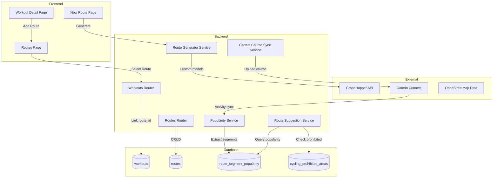
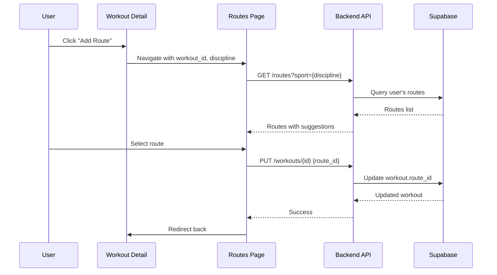
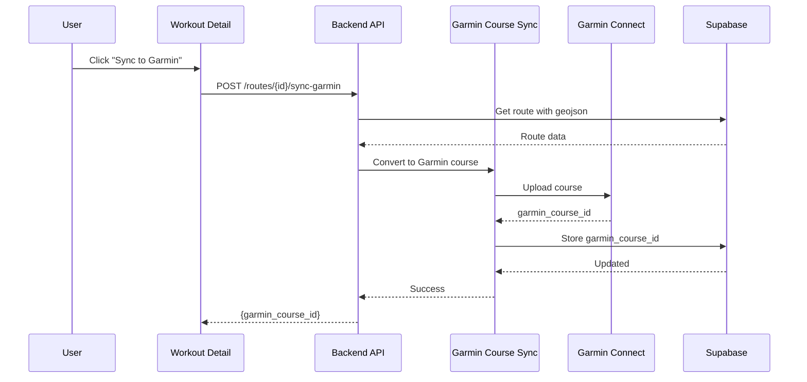

# Design Document: Workout Route Integration

## Overview

The Workout Route Integration feature connects the existing route planner with scheduled workouts, enabling athletes to attach routes to training sessions and sync them to Garmin devices for turn-by-turn navigation. The system collects anonymized route popularity data from completed activities to power intelligent route suggestions that respect discipline-specific road type restrictions.

### Key Capabilities

1. **Workout-Route Linking**: Attach saved routes to RUN, RIDE_ROAD, or RIDE_GRAVEL workouts via a `route_id` foreign key
2. **Smart Route Suggestions**: Recommend routes based on popularity, discipline compatibility, distance match, and elevation profile
3. **Route Popularity Tracking**: Collect anonymized segment usage data from synced Garmin activities
4. **Garmin Course Sync**: Upload cycling routes to Garmin Connect as courses for turn-by-turn navigation
5. **Road Type Filtering**: Ensure cycling routes use paved bike roads and avoid prohibited areas
6. **Cycling Prohibited Area Detection**: Maintain and query a database of areas where cycling is not permitted

### Integration Points

- **GraphHopper API**: Extended custom models for stricter road type filtering
- **Garmin Connect API**: Course upload via `garminconnect` library
- **Supabase**: New tables for popularity tracking and prohibited areas
- **Frontend Routes Page**: Workout context mode for route selection flow

## Architecture

### System Context Diagram



### Data Flow: Workout-Route Linking



### Data Flow: Garmin Course Sync



## Components and Interfaces

### Backend Services

#### 1. Route Suggestion Service (`backend/app/services/route_suggestions.py`)

Provides intelligent route recommendations based on popularity, discipline compatibility, and user preferences.

```python
@dataclass
class RouteSuggestion:
    route_id: str
    name: str
    distance_meters: float
    elevation_gain_meters: float
    popularity_score: float
    discipline_match_score: float
    distance_match_score: float
    elevation_match_score: float
    combined_score: float
    usage_count_90d: int
    surface_breakdown: dict[str, float]

async def get_route_suggestions(
    user_id: str,
    discipline: Literal["RUN", "RIDE_ROAD", "RIDE_GRAVEL"],
    target_distance_meters: float,
    start_lat: float,
    start_lng: float,
    target_elevation_gain: float | None = None,
    limit: int = 10,
    sb: AsyncClient,
) -> list[RouteSuggestion]:
    """
    Returns ranked route suggestions based on:
    - Popularity (40%): Usage count in last 90 days for this discipline
    - Route quality (30%): Surface/road type match for discipline
    - Distance match (20%): Proximity to target distance
    - Elevation match (10%): Proximity to target elevation gain
    
    For RIDE_ROAD: Filters to routes with ≥90% paved segments
    For all cycling: Excludes routes through prohibited areas
    """
```

#### 2. Garmin Course Sync Service (`backend/app/services/garmin_course_sync.py`)

Handles conversion of routes to Garmin course format and upload to Garmin Connect.

```python
@dataclass
class GarminCourseResult:
    garmin_course_id: int
    course_name: str
    uploaded_at: str

async def sync_route_to_garmin(
    route_id: str,
    user_id: str,
    sb: AsyncClient,
) -> GarminCourseResult:
    """
    Converts route geojson to Garmin FIT course format and uploads.
    Stores garmin_course_id on the route record.
    
    Raises:
        HTTPException 400: Garmin not connected
        HTTPException 404: Route not found
        HTTPException 500: Upload failed
    """

def convert_geojson_to_fit_course(
    geojson: dict,
    name: str,
    sport: str,
) -> bytes:
    """
    Converts GeoJSON LineString to Garmin FIT course format.
    Includes turn-by-turn navigation points derived from geometry.
    """
```

#### 3. Route Popularity Service (`backend/app/services/route_popularity.py`)

Collects and queries anonymized route segment popularity data.

```python
SEGMENT_RESOLUTION_METERS = 100

async def extract_and_store_segments(
    activity_id: str,
    polyline: str,
    discipline: str,
    sb: AsyncClient,
) -> int:
    """
    Extracts route segments from activity polyline and updates popularity counters.
    Returns number of segments processed.
    
    Segments are hashed at ~100m resolution for matching partial overlaps.
    Only processes activities with ≥500m valid GPS data.
    """

async def get_segment_popularity(
    segment_hashes: list[str],
    discipline: str,
    sb: AsyncClient,
) -> dict[str, int]:
    """
    Returns usage counts for given segment hashes.
    Applies time decay: 90-180 days = 50% weight, >180 days = 25% weight.
    """

def hash_segment(lat1: float, lng1: float, lat2: float, lng2: float) -> str:
    """
    Creates a consistent hash for a segment at ~100m resolution.
    Coordinates are rounded to 4 decimal places (~11m precision).
    """
```

#### 4. Cycling Prohibited Areas Service (`backend/app/services/prohibited_areas.py`)

Manages the database of areas where cycling is not permitted.

```python
async def check_route_prohibited_areas(
    geojson: dict,
    sb: AsyncClient,
) -> list[dict]:
    """
    Checks if any route segment passes through a cycling prohibited area.
    Returns list of intersecting areas with names and coordinates.
    """

async def refresh_prohibited_areas_from_osm(
    bounds: tuple[float, float, float, float],  # min_lat, min_lng, max_lat, max_lng
    sb: AsyncClient,
) -> int:
    """
    Fetches areas tagged with bicycle=no, bicycle=dismount, or access=no
    from OpenStreetMap Overpass API and updates the database.
    Returns number of areas updated.
    """
```

### Backend Routers

#### Routes Router Extensions (`backend/app/routers/routes.py`)

New endpoints for route suggestions and Garmin course sync:

```python
# GET /routes/suggestions
class RouteSuggestionRequest(BaseModel):
    discipline: str
    target_distance_meters: float
    start_lat: float
    start_lng: float
    target_elevation_gain: float | None = None

class RouteSuggestionResponse(BaseModel):
    id: str
    name: str
    distance_meters: float
    elevation_gain_meters: float | None
    popularity_score: float
    combined_score: float
    usage_count_90d: int
    surface_breakdown: dict[str, float] | None

@router.post("/suggestions", response_model=list[RouteSuggestionResponse])
async def get_suggestions(body: RouteSuggestionRequest, ...): ...

# POST /routes/{route_id}/sync-garmin
class GarminSyncResponse(BaseModel):
    garmin_course_id: int
    message: str

@router.post("/{route_id}/sync-garmin", response_model=GarminSyncResponse)
async def sync_to_garmin(route_id: str, ...): ...

# GET /routes/{route_id}/check-prohibited
class ProhibitedAreaCheck(BaseModel):
    has_prohibited_areas: bool
    areas: list[dict]

@router.get("/{route_id}/check-prohibited", response_model=ProhibitedAreaCheck)
async def check_prohibited_areas(route_id: str, ...): ...
```

#### Workouts Router Extensions (`backend/app/routers/workouts.py`)

Extended to support route linking:

```python
class WorkoutUpdate(BaseModel):
    # ... existing fields ...
    route_id: str | None = None  # New field for linking

class WorkoutResponse(BaseModel):
    # ... existing fields ...
    route_id: str | None  # New field
    route: RouteResponse | None  # Nested route data when linked

@router.put("/{workout_id}/route")
async def link_route(workout_id: str, route_id: str | None, ...):
    """Link or unlink a route from a workout."""

@router.delete("/{workout_id}/route")
async def unlink_route(workout_id: str, ...):
    """Remove route link from workout."""
```

### Frontend Components

#### 1. Workout Detail Route Section

New component in `frontend/app/(app)/workouts/[id]/route-section.tsx`:

```typescript
interface RouteSectionProps {
  workout: Workout;
  onRouteLinked: (routeId: string | null) => void;
}

export function RouteSection({ workout, onRouteLinked }: RouteSectionProps) {
  // Shows:
  // - "Add Route" button if no route linked
  // - Route preview card with map, distance, elevation if linked
  // - "Remove Route" and "Sync to Garmin" buttons when linked
}
```

#### 2. Routes Page Workout Context Mode

Extended `frontend/app/(app)/routes/page.tsx` to handle workout context:

```typescript
// URL: /routes?workout_id=xxx&discipline=RUN&duration=3600

interface WorkoutContext {
  workoutId: string;
  discipline: Discipline;
  estimatedDuration: number;
  suggestedDistance: number; // Calculated from duration + pace
}

// Shows banner: "Selecting route for: Morning Run (10km target)"
// Pre-filters routes by discipline
// Shows "Select" button instead of just viewing
// On select: links route and redirects back to workout
```

#### 3. Route Suggestion Cards

New component for displaying suggested routes with popularity indicators:

```typescript
interface RouteSuggestionCardProps {
  suggestion: RouteSuggestion;
  onSelect: () => void;
}

// Shows:
// - Route name and distance
// - Popularity indicator (🔥 Popular, ⭐ Recommended)
// - Usage count badge: "Used by 47 athletes"
// - Surface breakdown for cycling routes
// - Mini map preview
```

## Data Models

### Database Schema Changes

#### 1. Workouts Table Extension

```sql
-- Add route_id column to workouts table
ALTER TABLE workouts
ADD COLUMN route_id UUID REFERENCES routes(id) ON DELETE SET NULL;

-- Index for efficient lookups
CREATE INDEX idx_workouts_route_id ON workouts(route_id);
```

#### 2. Routes Table Extension

```sql
-- Add Garmin course tracking and surface breakdown
ALTER TABLE routes
ADD COLUMN garmin_course_id BIGINT,
ADD COLUMN surface_breakdown JSONB;

-- Index for Garmin course lookups
CREATE INDEX idx_routes_garmin_course_id ON routes(garmin_course_id);
```

#### 3. Route Segment Popularity Table (New)

```sql
CREATE TABLE route_segment_popularity (
    id UUID PRIMARY KEY DEFAULT gen_random_uuid(),
    segment_hash TEXT NOT NULL,
    discipline TEXT NOT NULL,
    usage_count INTEGER NOT NULL DEFAULT 1,
    last_used_at TIMESTAMPTZ NOT NULL DEFAULT NOW(),
    coordinates JSONB NOT NULL, -- {lat1, lng1, lat2, lng2}
    created_at TIMESTAMPTZ NOT NULL DEFAULT NOW(),
    
    CONSTRAINT unique_segment_discipline UNIQUE (segment_hash, discipline)
);

-- Indexes for efficient querying
CREATE INDEX idx_segment_popularity_hash ON route_segment_popularity(segment_hash);
CREATE INDEX idx_segment_popularity_discipline ON route_segment_popularity(discipline);
CREATE INDEX idx_segment_popularity_last_used ON route_segment_popularity(last_used_at);
```

#### 4. Cycling Prohibited Areas Table (New)

```sql
CREATE TABLE cycling_prohibited_areas (
    id UUID PRIMARY KEY DEFAULT gen_random_uuid(),
    area_name TEXT,
    geometry JSONB NOT NULL, -- GeoJSON Polygon
    osm_id BIGINT,
    source TEXT NOT NULL DEFAULT 'osm',
    restriction_type TEXT, -- 'no', 'dismount', 'private'
    updated_at TIMESTAMPTZ NOT NULL DEFAULT NOW(),
    created_at TIMESTAMPTZ NOT NULL DEFAULT NOW()
);

-- Spatial index simulation using bounding box
CREATE INDEX idx_prohibited_areas_bbox ON cycling_prohibited_areas 
    USING GIN (geometry jsonb_path_ops);
```

### Pydantic Models

#### Backend Row Models (`backend/app/models.py`)

```python
class WorkoutRow(BaseModel):
    # ... existing fields ...
    route_id: str | None = None  # New field

class RouteRow(BaseModel):
    # ... existing fields ...
    garmin_course_id: int | None = None  # New field
    surface_breakdown: dict | None = None  # New field

class RouteSegmentPopularityRow(BaseModel):
    id: str = ""
    segment_hash: str = ""
    discipline: str = ""
    usage_count: int = 0
    last_used_at: str = ""
    coordinates: dict = Field(default_factory=dict)
    created_at: str = ""

class CyclingProhibitedAreaRow(BaseModel):
    id: str = ""
    area_name: str | None = None
    geometry: dict = Field(default_factory=dict)
    osm_id: int | None = None
    source: str = "osm"
    restriction_type: str | None = None
    updated_at: str = ""
    created_at: str = ""
```

#### Frontend Types (`frontend/lib/types.ts`)

```typescript
// Extended Route type
export interface Route {
  id: string;
  name: string;
  sport: Discipline;
  start_lat: number;
  start_lng: number;
  end_lat: number | null;
  end_lng: number | null;
  is_loop: boolean;
  distance_meters: number | null;
  elevation_gain_meters: number | null;
  elevation_loss_meters: number | null;
  estimated_duration_seconds: number | null;
  geojson: GeoJSON.Feature | null;
  gpx_data: string | null;
  garmin_course_id: number | null;  // New
  surface_breakdown: Record<string, number> | null;  // New
}

// Extended Workout type
export interface Workout {
  // ... existing fields ...
  route_id: string | null;  // New
  route: Route | null;  // New - nested when fetched with include
}

// Route suggestion type
export interface RouteSuggestion {
  id: string;
  name: string;
  distance_meters: number;
  elevation_gain_meters: number | null;
  popularity_score: number;
  combined_score: number;
  usage_count_90d: number;
  surface_breakdown: Record<string, number> | null;
}

// Workout context for route selection
export interface WorkoutRouteContext {
  workoutId: string;
  discipline: Discipline;
  estimatedDuration: number;
  suggestedDistanceMeters: number;
}
```

